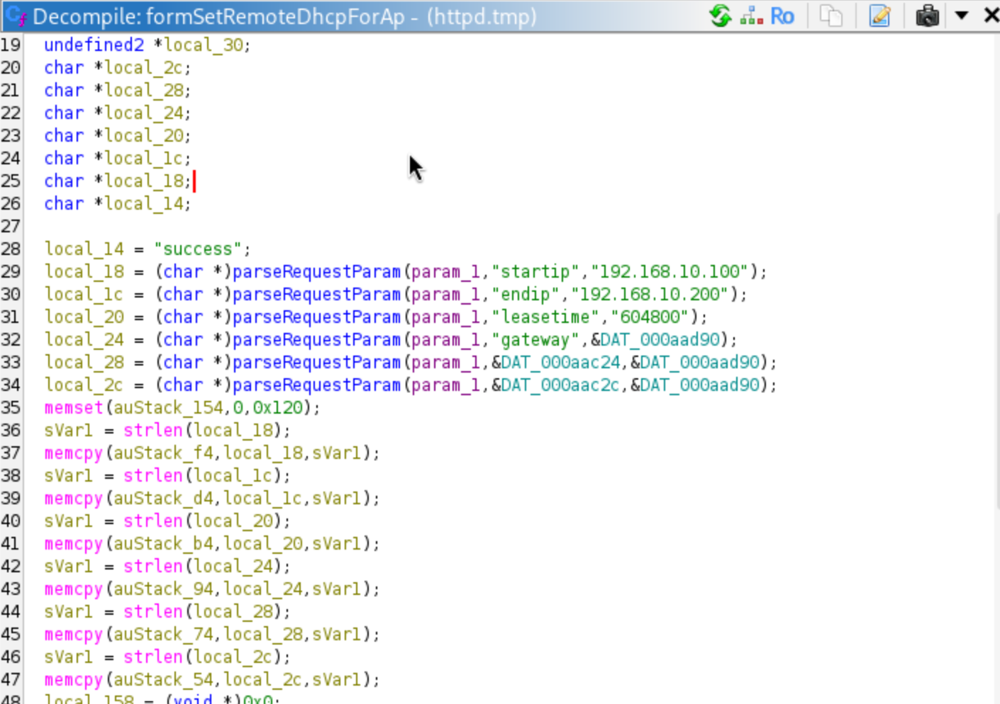
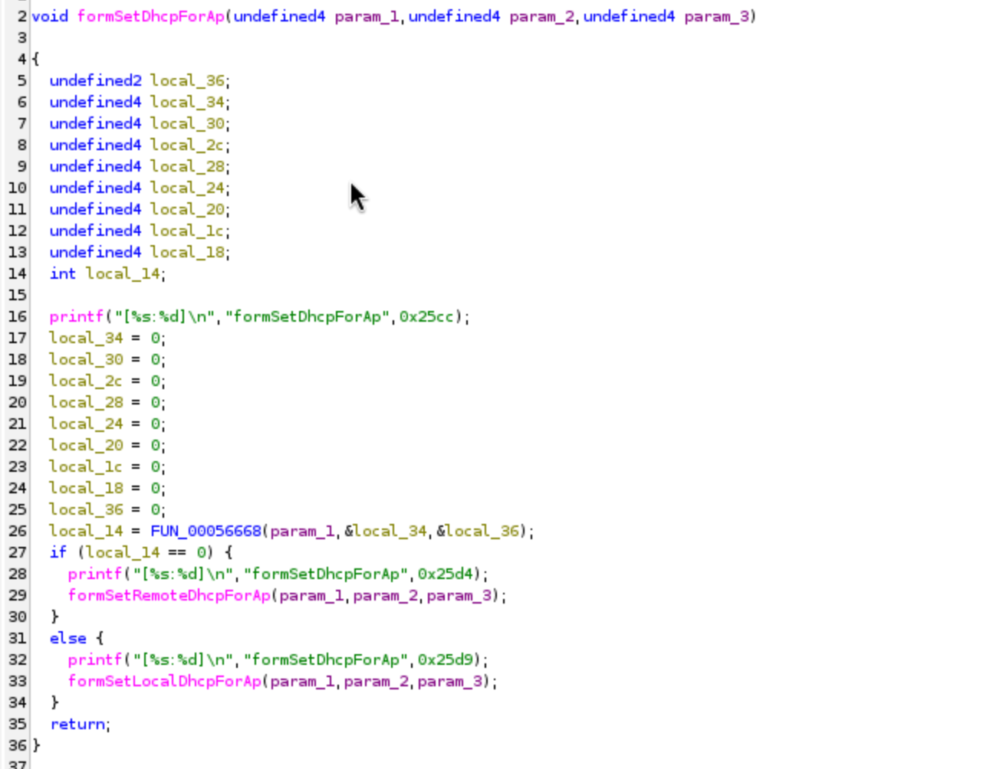
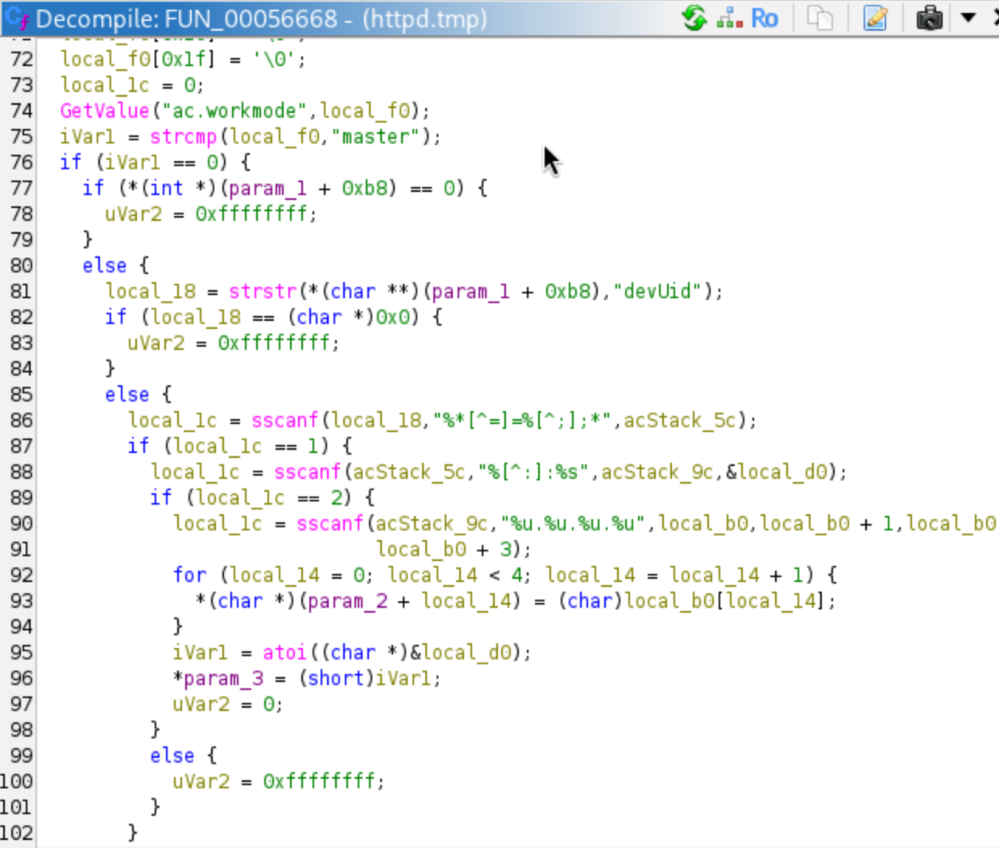
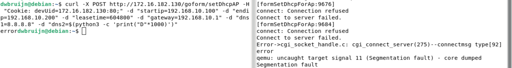

# Tenda M3 formSetRemoteDhcpForAp Stack Overflow

## Description

The **formSetDhcpForAp** handler in `/bin/httpd` calls **formSetRemoteDhcpForAp** (under certain conditions) which is vulnerable to multiple stack overflows due to the absence of user input sanitization and bounds checking on parameters **startip**, **endip**, **leasetime**, **gateway**, **dns1**, and **dns2** which can lead to corruption of data on the stack, hijacking of control flow, and DoS. The attack can be performed remotely.

## Details

*   **Vendor**: Tenda

*   **Product**: Tenda M3

*   **Firmware Version**: V1.0.0.13(4903)_CN&EN

*   **Firmware Download**: https://www.tendacn.com/material/show/104888

*   **Component**: `/goform/setDhcpAP` (formSetDhcpForAp handler -> formSetRemoteDhcpForAp())

*   **Vulnerability Type**: Buffer Overflow (CWE-120) and Memory Corruption (CWE-119)

*   **CVE ID**: Requested

*   **Reported by**: Charbel


## PoC

The vulnerability is in the `memcpy()` calls with no bounds checking.



Let's examine `formSetDhcpForAp` and see how `formSetRemoteDhcpForAp` is called



As we can see, we need `FUN_00056668` to return 0, so let's examine that function



So we need the following:  
✅ 1. Router configured with `ac.workmode=master` (can be set through `/bin/cfm`, or simply patch `/bin/httpd` if you're feeling lazy)  
✅ 2. HTTP request includes Cookie header  
✅ 3. Cookie contains devUid parameter  
✅ 4. devUid format: devUid=IP:PORT;  
✅ 5. IP must be valid dotted-quad format (xxx.xxx.xxx.xxx)  

Now we ca send a POST request to the `/goform/setDhcpAP` endpoint to trigger the stack overflow in `formSetRemoteDhcpForAp` and we can deliver the payload using any of the 6 parameters

```
curl -X POST http://172.16.182.130/goform/setDhcpAP -H "Cookie: devUid=172.16.182.130:80;" -d "startip=192.168.10.100" -d "endip=192.168.10.200" -d "leasetime=604800" -d "gateway=192.168.10.1" -d "dns1=8.8.8.8" -d "dns2=$(python3 -c 'print("D"*1000)')"
```


