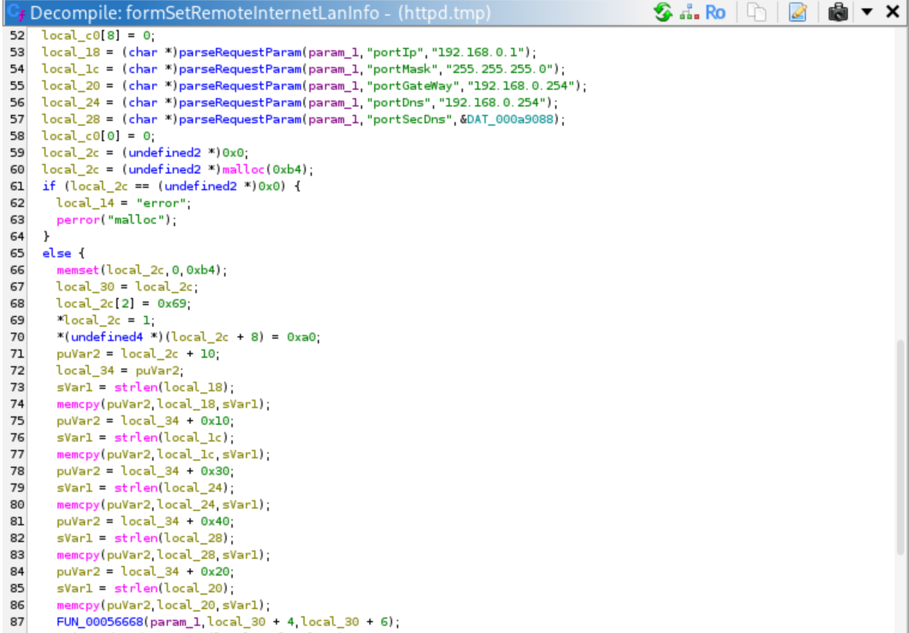
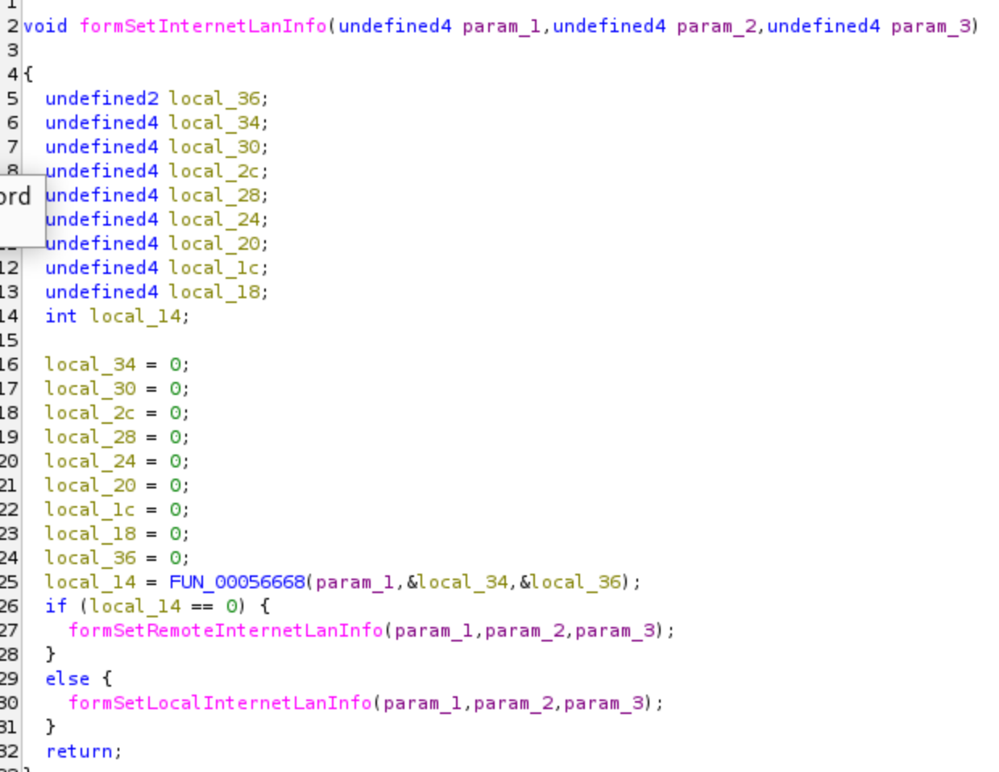
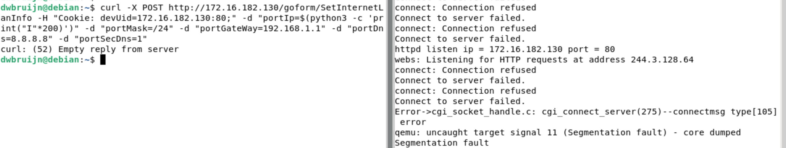

# Tenda M3 formSetRemoteInternetLanInfo Heap Overflow

## Description

The **formSetInternetLanInfo** handler in `/bin/httpd` calls **formSetRemoteInternetLanInfo** (under certain conditions) which is vulnerable to multiple heap overflows due to the complete absence of user input sanitization and bounds checking on parameters **portIp**, **portMask**, **portGateWay**, **portDns**, and **portSecDns**.

## Details

*   **Vendor**: Tenda

*   **Product**: Tenda M3

*   **Firmware Version**: V1.0.0.13(4903)_CN&EN

*   **Firmware Download**: https://www.tendacn.com/material/show/104888

*   **Component**: `/goform/setInternetLanInfo` (formSetInternetLanInfo handler -> formSetRemoteInternetLanInfo())

*   **Vulnerability Type**: Heap-based Buffer Overflow (CWE-122) and Memory Corruption (CWE-119)

*   **CVE ID**: CVE-2025-15234

*   **Reported by**: Charbel


## PoC

The vulnerability is in the `memcpy()` calls with no bounds checking.



Let's examine `formSetInternetLanInfo` and see how `formSetRemoteInternetLanInfo` is called



As we can see, we need `FUN_00056668` to return 0, so let's examine that function


So we need the following:  
✅ 1. Router configured with `ac.workmode=master` (can be set through `/bin/cfm`, or simply patch `/bin/httpd` if you're feeling lazy)  
✅ 2. HTTP request includes Cookie header  
✅ 3. Cookie contains devUid parameter  
✅ 4. devUid format: devUid=IP:PORT;  
✅ 5. IP must be valid dotted-quad format (xxx.xxx.xxx.xxx)

Now we can send a POST request to the `/goform/setInternetLanInfo` endpoint to trigger the heap overflow in `formSetRemoteInternetLanInfo`

```
curl -X POST http://172.16.182.130/goform/SetInternetLanInfo -H "Cookie: devUid=172.16.182.130:80;" -d "portIp=$(python3 -c 'print("I"*200)')" -d "portMask=/24" -d "portGateWay=192.168.1.1" -d "portDns=8.8.8.8" -d "portSecDns=1"
```


